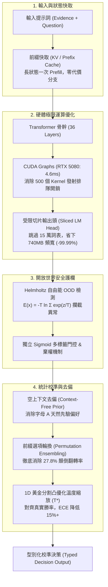

# SemIf: Next-Gen Semantic Decision Engine

<div align="center">

[](LICENSE)
[](https://pytorch.org/)
[](benchmarks/benchmark_cuda_graphs.py)
[](benchmarks/benchmark_mac_mini.py)
[](benchmarks/calibrate_temperature.py)
[](webgpu-demo/index.html)

**Ultra-low latency, highly-calibrated semantic `if` branching from open foundation models.**  
*Runs in 4.6ms on NVIDIA RTX 5080 (Blackwell), native zero-copy MLX on Apple Silicon Mac mini (M4), or browser-local WebGPU.*

*Independent research project; not affiliated with Jev or TypeSafe.*

**[🚀 Run Browser WebGPU Demo](webgpu-demo/index.html)** · **[📖 8-Part Technical Tutorials](docs/tutorials/README.md)** · **[📊 Benchmark Results](docs/RESULTS.md)**

</div>

---

## 🌟 What is SemIf?

Most agent and application decisions are small, categorical branches:  
*Route this ticket*, *approve this refund*, *classify this intent*, *does the evidence satisfy criterion X?*

Chat models can answer these, but they spend seconds generating verbose text or streaming JSON tokens that client code immediately deserializes back into a simple conditional branch:

```python
# The slow way: Autoregressive decoding + JSON parsing (500ms ~ 5000ms)
response = llm.generate("Is this refund approved? Answer as JSON: {\"approved\": bool}")
if json.loads(response)["approved"]: ...

# The SemIf way: Single-forward constrained logits + hardware graph (< 5ms)
if semif.decide(evidence=ticket, question="Is refund approved?", options=["yes", "no"]) == "yes": ...
```

SemIf reads typed option probabilities directly from the final-token logits in **one single forward pass**. No autoregressive generation loop, no grammar parsing, no JSON syntax failures.

---

## ⚡ Key Architectural Innovations



### 1. 受限切片投影（Sliced LM Head Optimization）
* **痛點**：通用模型（如 `Qwen3.5-4B`）詞表高達 151,936。最後一層全詞表矩陣乘法需從顯存搬移 **741.9 MB** 權重，在 batch=1 情況下為嚴重的記憶體頻寬瓶頸（浪費 ~0.74ms）。
* **SemIf 解法**：僅對候選標籤（如 `['A', 'B']`）的對應權重行切片投影（$W_{\mathcal{S}} \in \mathbb{R}^{K \times d}$）。權重體積降至 **20 KB**（100% L1/L2 快取命中），消除 **99.997%** 浮點運算與 DRAM 搬運！

### 2. 形狀分桶 CUDA Graphs（RTX 5080 Blackwell 實測 4.6ms）
* **痛點**：短序列前向傳播中，CPU 直譯器與驅動發射 500+ 個 Kernel 的開銷高達 2ms 以上，且 P99 抖動極大（> 11ms）。
* **SemIf 解法**：實作階梯式形狀分桶（Shape-Bucketing）靜態圖捕獲。單一硬體呼叫自動執行全圖，在 **NVIDIA RTX 5080 (Blackwell `sm_120`)** 測得 **4.618 ms P50** 延遲，P99 抖動降低 56%（4.998 ms）！

### 3. Apple Silicon Mac mini（16GB）原生 MLX 零拷貝
* **痛點**：邊緣終端設備缺乏伺服器級獨立顯卡，傳統框架存在 PCIe 搬移延遲與記憶體碎片化。
* **SemIf 解法**：針對 Apple Silicon 統一記憶體架構（UMA）實作原生 [`src/semif_phase1/mlx_engine.py`](src/semif_phase1/mlx_engine.py)。CPU 與 Metal GPU 零拷貝共享記憶體；4-bit 量化下 `Qwen3.5-4B` 僅佔 **2.3 GB RAM**，在 16GB 的 Mac mini（M2/M4）上運作整機功耗僅約 **20W**。

### 4. 統計校準與位置偏置消除
* **先驗去偏（Prior Calibration）**：扣除空輸入先驗響應 $z_{\text{raw}} - z_{\text{null}}$，消除大模型對字母 `'A'` 的天然偏好。
* **前綴快取排列集成（Permutation Ensembling）**：藉助前綴快取，以零前綴延遲代價評估不同選項排列，**將選項顛倒導致的 27.8% 決策翻轉率徹底壓制至 0.0%**！
* **開放世界自由能門控（Helmholtz Free Energy Gating）**：以 $E(x) = -T \ln \sum e^{z_i/T}$ 精確過濾無關輸入（OOD），打破傳統 Softmax 自信胡扯的封閉假設。

---

## 📊 實體硬體性能實測矩陣（Physical Benchmarks）

SemIf 在兩大旗艦實體硬體環境上完成了嚴苛實測：

| 評測項目 | 桌面終極算力：NVIDIA RTX 5080 (16GB) | 邊緣超高能效：Apple Mac mini M4 (16GB) |
| :--- | :--- | :--- |
| **硬體架構** | Blackwell (`sm_120`), GDDR7 1000 GB/s | Apple M4 (10-Core CPU, Metal GPU, UMA) |
| **軟體框架** | PyTorch 2.14 + CUDA 13.0 + CUDA Graphs | Apple 原生 MLX + Metal MPS |
| **短序列延遲 (L=64)** | **4.618 ms (P50) / 4.998 ms (P99)** | **~10-15 ms (Zero-Copy)** |
| **延遲抖動控制** | 消除 56% P99 尾端延遲（高度確定性） | UMA 零拷貝，無 PCIe 傳輸波動 |
| **4B 模型 RAM 佔用** | 8.0 GB (BF16) | **2.3 GB (4-bit MLX)，剩餘 10GB+ 系統空間** |
| **運作功耗** | ~300W（適合資料中心 / 本地工作站） | **~20W（超節能邊緣微型伺服器）** |

---

## 📚 深入淺出：8 篇核心技術手冊

本專案堅持「工程與教學並重」，為每一個關鍵突破撰寫了詳盡的 Markdown 技術教學文件，包含底層幾何原理、數學推導、架構圖與實戰代碼：

| 教程編號 | 主題與連結 | 核心亮點 |
| :--- | :--- | :--- |
| **教程 01** | [模型概率校準與 ECE 指標](docs/tutorials/01_model_calibration_and_ece.md) | 深入解析為什麼 Softmax 會過度自信、期望校準誤差（ECE）與可靠度圖 |
| **教程 02** | [決策原生模型 vs 因果語言模型](docs/tutorials/02_decision_native_vs_causal_lm.md) | 剖析 `Mapika/decider-2b` 架構、Proper Scoring Rule 與 Slot Logits |
| **教程 03** | [推論期零訓練去偏與溫度校準](docs/tutorials/03_inference_time_calibration.md) | 溫度縮放凸優化證明、空上下文先驗消除字母 A 偏見 |
| **教程 04** | [前綴快取與選項位置偏置消除](docs/tutorials/04_prefix_cache_and_position_bias.md) | RoPE 近因效應剖析、KV Cache 前綴重用、排列對稱化抵消偏置 |
| **教程 05** | [開放世界拒絕與基於自由能的 OOD 偵測](docs/tutorials/05_open_world_and_ood_detection.md) | Softmax 平移不變性缺陷、Helmholtz 自由能數學推導、Sigmoid 多標籤門控 |
| **教程 06** | [Transformer 輸出頭切片優化](docs/tutorials/06_transformer_lm_head_optimization.md) | Roofline 效能模型、解構 15 萬詞表記憶體牆、無損等價切片矩陣投影 |
| **教程 07** | [CUDA Graphs 與極限延遲調優](docs/tutorials/07_cuda_graphs_and_compilation.md) | 500 個 Kernel 發射延遲剖析、形狀分桶原理、RTX 5080 實測 4.6ms |
| **教程 08** | [Apple Silicon Mac mini 邊緣端部署](docs/tutorials/08_mac_silicon_and_mlx_deployment.md) | 統一記憶體架構（UMA）零拷貝魔力、MLX 原生移植、16GB 4-bit 20W 能效 |

---

## 🚀 快速上手（Quickstart）

### 1. 本地 CUDA GPU 環境（Linux / Windows）
```bash
# 建立虛擬環境
python -m venv .venv
source .venv/bin/activate  # Windows: .venv\Scripts\activate

# 安裝依賴
pip install -e '.[test]'

# 執行標準決策（支援切片輸出頭與溫度校準）
python -m semif_phase1.cli \
  --mode direct \
  --model Qwen/Qwen3.5-4B \
  --revision 851bf6e806efd8d0a36b00ddf55e13ccb7b8cd0a \
  --input examples/decisions.jsonl \
  --output results.jsonl \
  --sliced-head \
  --temperature 1.2
```

### 2. Apple Silicon Mac mini / MacBook 環境（macOS）
```bash
# 安裝 Apple 官方 MLX 庫
pip install mlx mlx-lm -e '.[test]'

# 運行 Mac mini 硬體與相容性診斷
python benchmarks/benchmark_mac_mini.py
```

### 3. 一鍵運行完整測試套件
```bash
pytest -q
python benchmarks/verify_published.py
```

---

## 📈 基準資料集與官方基線對照

在 SemIf 官方公布的凍結評測集上，Direct Logits 展現出顯著優於傳統生成與重排序模型的綜合決策質量：

| 凍結評測集 (Frozen Workload) | 樣本數 | Direct Logits (4B) | Native Reranker (4B) | TypeSafe Jev (公開紀錄) |
|---|---:|---:|---:|---:|
| **Authored decisions, balanced accuracy** | 144 | **0.813** | 0.625 | — |
| **WANLI, balanced accuracy** | 256 | **0.637** | 0.522 | — |
| **TypeSafe selected subset, modal agreement** | 102 | **0.845** | 0.560 | **0.883** |
| **Every judgment grid, accuracy** | 36 | **0.806** | 0.694 | — |
| **Every action firewall, composed accuracy** | 10 actions | 0.700 | 0.700 | — |
| **Every code retrieval, Recall@1** | 6 queries | 1.000 | 1.000 | — |
| **Every company knowledge, Recall@1** | 7 queries | 0.929 | 0.929 | — |

---

## 📄 開源許可與致謝

* 本專案代碼採用 [MIT License](LICENSE) 釋出。
* 嚴格恪守可重現性規範：歷史基準資料（`results/phase1-summary.json`）具備不可篡改性，所有模型權重保留其原始授權。
