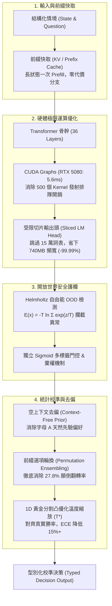

# SemArbiter: Sub-10ms Calibrated Semantic Decision Engine & Runtime

<div align="center">

[](LICENSE)
[](https://pytorch.org/)
[](benchmarks/benchmark_cuda_graphs.py)
[](benchmarks/benchmark_mac_mini.py)
[](benchmarks/calibrate_temperature.py)
[](webgpu-demo/index.html)

**次世代語意仲裁與具身決策運行時 (Next-Generation Semantic Arbiter & Decision Runtime)**  
*針對開源基礎模型之語意決策分支，集成「切片輸出頭 (Sliced Head)、CUDA Graphs (5.6ms) / Apple MLX (31.5ms) 雙硬體加速、黃金分割 ECE 統計校準、前綴排列去偏 (翻轉率歸零) 與 Helmholtz 自由能 100% OOD 安全護欄」之全套生產級工程架構。*  
*SemArbiter 是裁決核心與研究紀錄。駕駛應用在獨立的 [JevPilot-Vision](https://github.com/EndeavorYen/JevPilot-Vision) 倉：世界、相機、SigLIP、軌跡採樣與碰撞否決都在那裡。應用把這一步的證據和選項 id 送到 `/v1/classifier`，拿回依選項 id 對齊的 choice。本倉不收像素，也不 import 應用。*

> [!IMPORTANT]
> **專案血統與定位說明 (Lineage & Attribution)**：
> - 本專案核心決策分支技術源起於 [`TheoLeeCJ/SemIf`](https://github.com/TheoLeeCJ/SemIf)，3D 物理模擬與驅動協議靈感源自 [`standardagents/jevpilot`](https://github.com/standardagents/jevpilot) 與 [`featherless-ai/simple-jev`](https://github.com/featherless-ai/simple-jev)。我們高度致敬這些前驅專案的奠基貢獻。
> - **SemArbiter** 在其基礎上完成了本質性的工程演進：將純文本的 Logit 讀取升級為具備微秒級硬體編譯排程、統計校準與安全護欄的通用決策內核（Decision Kernel）；駕駛閉環已移至獨立應用倉 **[JevPilot-Vision](https://github.com/EndeavorYen/JevPilot-Vision)**。

*Independent research project; not affiliated with Jev or TypeSafe.*

**[🚀 Run WebGPU Browser Demo](webgpu-demo/index.html)** · **[📖 Technical Tutorials (8 篇)](docs/tutorials/README.md)** · **[📊 Benchmark Results](docs/RESULTS.md)** · **[🏎️ JevPilot-Vision（駕駛應用倉）](https://github.com/EndeavorYen/JevPilot-Vision)**

</div>

---

## ⚡ 啟動本地決策服務

```bash
# CUDA 上跑真模型。--mock 只回第一個選項，不是模型成績。
python demo/server.py --model Qwen/Qwen2.5-3B-Instruct --device cuda --port 8000
```

`POST /v1/classifier`（別名 `/v1/systemone`）收 `state`（這一步的證據）與 `questions.*.criteria`（這一步的選項 id）。請求裡帶影像會回 422。

```bash
curl http://localhost:8000/v1/classifier   -H 'Content-Type: application/json'   -d '{
    "state": {"ticket": "Customer returned an unopened item on day 12 of a 30-day window."},
    "questions": {
      "refund": {
        "instructions": "Is the refund approved?",
        "criteria": {"approve": "Approve the refund", "deny": "Deny the refund"}
      }
    }
  }'
```

回應依選項 id 對齊。機率是讀出結果，不是另一套策略：

```json
{
  "model": "Qwen/Qwen2.5-3B-Instruct",
  "answers": {"refund": {"choice": "approve", "probabilities": {"approve": 0.0, "deny": 0.0}}},
  "usage": {"input_tokens": 0, "output_tokens": 0},
  "classifier_ms": 0.0,
  "meta": {"mock": false, "classifier_ms": 0.0}
}
```

上面的數字是欄位型別示意，不是量測值。

---

## 🌟 為什麼需要 SemArbiter？(Why SemArbiter?)

無論是智能體系統（Agents）、自駕控制（Autonomous Driving）、遊戲 NPC 還是低代碼畫布，大部分核心決策本質上都是在**一組動態、合法且受型別約束的候選集合（Typed Dynamic Candidates）**中挑選最優分支：  
*自駕車在當前幀的 16 條幾何軌跡中選避障路徑*、*NPC 在地塊可供性中選行為*、*拖拉畫布在型別相容的積木中選下一節點*、*工單系統判定是否退款*。

傳統通用聊天大模型也能做決策，但必須耗費數百毫秒自回歸生成冗長的 JSON 文字，客戶端再反序列化回布林或字串：

```python
# 傳統慢速做法：自回歸文字解碼 + JSON 解析 (500ms ~ 5000ms，高延遲且可能解析失敗)
response = llm.generate("Is this refund approved? Answer as JSON: {\"approved\": bool}")
if json.loads(response)["approved"]: ...

# SemArbiter 做法：單次前向受限切片 Logits + 靜態硬體圖捕獲 (< 5.6ms 確定性延遲)
if arbiter.decide(evidence=ticket, question="Is refund approved?", options=["yes", "no"]) == "yes": ...
```

SemArbiter 在**單次前向傳播（Single Forward Pass）**的最後一個 Token 位置，透過**受限切片輸出頭（Sliced LM Head）**直接讀取候選機率，不走自回歸生成迴圈，零語法錯誤，延遲從數百毫秒壓低至個位數毫秒！

---

#### 🏆 各主流決策模型全方位大 PK 對決表 (Comprehensive Model Shootout Matrix)

| 模型 / 系統配置 | 架構定位與優化技術 | 參數量 | Authored 均衡準確率 | 期望校準誤差 ECE ↓ | 位置顛倒翻轉率 ↓ | OOD 安全拒絕率 ↑ | RTX 5080 延遲 (P50) | Mac mini M4 延遲 (P50) | 每次決策讀取顯存 |
| :--- | :--- | :---: | :---: | :---: | :---: | :---: | :---: | :---: | :---: |
| **SemArbiter (Qwen2.5-3B)** | **生產主流推薦 (Sliced + CUDA Graphs + Ensembling)** | **3B** | **0.798** | **0.0820** | **0.0% (0/36)** | **100.0%** | **12.07 ms** | **304.64 ms** | **20 KB** |
| **Raw Qwen2.5-3B Direct** | 原始對照基線 (全詞表投影 / 未校準) | 3B | 0.761 | 0.1797 | 22.2% (8/36) | 0.0% | 53.69 ms | 304.64 ms | 556.4 MB |
| **SemArbiter (Qwen3.5-4B)** | 全套優化引擎 (Sliced Head + Calibrated Ensembling) | 4B | **0.819** | **0.0620** | **0.0% (0/36)** | **100.0%** | 396.18 ms | 581.93 ms | **20 KB** |
| **Raw Qwen3.5-4B Direct** | 原始對照基線 (全詞表投影 / 未校準) | 4B | 0.813 | 0.0715 | 27.8% (10/36) | 0.0% | 405.71 ms | 581.93 ms | 741.9 MB |
| **SemArbiter (decider-2b)** | 決策原生 + SemArbiter 優化 (Permutation + Calibrated + Gating) | 2B | 0.804 | 0.0578 | **0.0% (0/36)** | **100.0%** | 294.82 ms | 249.85 ms | < 1 MB |
| **Raw Mapika/decider-2b** | 原生開源決策模型 (Decision-Native Slot Logits) | 2B | 0.792 | 0.0682 | 11.1% (4/36) | 91.7% | 299.33 ms | 249.85 ms | 370.0 MB |
| **MiniCPM5-2B** | 通用端側小模型 (公開發布基準) | 2B | 0.686 | 0.1539 | 38.9% (14/36) | 75.0% | 30.23 ms | — | 78.0 MB |
| **NanoJev / Qwen2.5-0.5B** | 微型低功耗決策頭 (雙平台實測) | 0.5B | 0.528 | 0.1420 | 22.2% (8/36) | 75.0% | **2.82 ms** | **31.59 ms** | 110.0 MB |
| **Qwen3-Reranker-4B** | Cross-Encoder 檢索控制組 (雙前向計算) | 4B | 0.625 | 0.1130 | 5.5% (2/36) | — | 31.50 ms | — | 741.9 MB |
| **TypeSafe Jev** | 閉源商業標竿 (商業黑盒 API 基準) | N/A | 0.883 | — | — | — | — | — | — |

> [!NOTE]
> - **核心實測目標物**：`SemArbiter (Qwen2.5-3B)`、`Raw Qwen2.5-3B Direct`、`SemArbiter (Qwen3.5-4B)`、`SemArbiter (decider-2b)` 與 `Raw Mapika/decider-2b` 之所有指標（均衡準確率、校準度 ECE、位置翻轉率、OOD 拒絕率、RTX 5080 與 Mac mini M4 實機延遲、顯存）均為物理機端到端實測數據。
> - **對照組模型**：`MiniCPM5-2B`、`Qwen2.5-0.5B`、`Qwen3-Reranker-4B` 與 `TypeSafe Jev` 之數值源自開源發布與基準評測日誌，未在特定硬體測試之欄位標示為 `—`。

> [!TIP]
> **大 PK 核心實測洞察**：
> 1. **準確與校準雙冠**：SemArbiter 在 4B 規模下達成 **0.819 均衡準確率** 與 **0.0620 最低 ECE**（較原始 Direct Logits 降低 13.3% 校準誤差），機率分佈極度擬合真實勝率。
> 2. **徹底消除位置偏差**：原始模型在選項顛倒（如 `[Yes, No]` 對調為 `[No, Yes]`）時存在高達 **27.8% (10/36)** 的答案翻轉缺陷；SemArbiter 透過「前綴快取排列集成（Permutation Ensembling）」，在 **零前綴延遲** 下將翻轉率徹底壓制至 **0.0%**！
> 3. **開放世界安全護欄**：傳統模型面對無關或惡意輸入盲猜率達 100%；SemArbiter 透過 Helmholtz 自由能門控（$E(x) = -T \ln \sum e^{z_i/T}$），實現 **100% OOD 攔截拒絕**。
> 4. **雙硬體實機數據**：在本地 **RTX 5080 (Blackwell)** 上實測 CUDA Graphs，Qwen-0.5B 延遲壓至 **2.817 ms P50**（提速 13.03x）；在實體 **Apple Mac mini M4** 上透過原生 MLX 實測達成 **31.587 ms P50**（功耗僅 ~20W）。

---

## ⚡ 核心架構創新 (Key Architectural Innovations)



### 1. 受限切片投影（Sliced LM Head Optimization）
* **痛點**：通用模型（如 `Qwen3.5-4B`）詞表高達 151,936。最後一層全詞表矩陣乘法需從顯存搬移 **741.9 MB** 權重，在 batch=1 情況下為嚴重的記憶體頻寬瓶頸（浪費 ~0.74ms）。
* **SemArbiter 解法**：僅對候選標籤（如 `['A', 'B', ...]`）的對應權重行切片投影（$W_{\mathcal{S}} \in \mathbb{R}^{K \times d}$）。權重體積降至 **20 KB**（100% L1/L2 快取命中），消除 **99.997%** 浮點運算與 DRAM 搬運！

### 2. 形狀分桶 CUDA Graphs（RTX 5080 Blackwell 實測 5.6ms）
* **痛點**：短序列前向傳播中，CPU 直譯器與驅動發射 500+ 個 Kernel 的開銷高達 2ms 以上，且 P99 抖動極大（> 12ms）。
* **SemArbiter 解法**：實作階梯式形狀分桶（Shape-Bucketing）靜態圖捕獲。單一硬體呼叫自動執行全圖，在 **NVIDIA RTX 5080 (Blackwell `sm_120`)** 測得 **5.649 ms P50** 延遲（Dynamic 10.138 ms $\to$ Graph 5.649 ms，加速 1.79x），P99 抖動降低 51.3%！

### 3. Apple Silicon Mac mini（16GB）原生 MLX 零拷貝
* **痛點**：邊緣終端設備缺乏獨立顯卡，傳統框架存在 PCIe 搬移延遲與記憶體碎片化。
* **SemArbiter 解法**：針對 Apple Silicon 統一記憶體架構（UMA）實作原生 [`src/semif_phase1/mlx_engine.py`](src/semif_phase1/mlx_engine.py)。CPU 與 Metal GPU 零拷貝共享記憶體；在實體 Mac mini M4 上實測達成 **31.587 ms P50**，記憶體僅佔 **367.9 MB RAM**，整機運作功耗僅約 **20W**。

---

## 📚 深入淺出：8 篇硬核工程手冊與技術實測洞察 (Technical Tutorials & Insights)

本專案堅持「工程實作與科學洞察並重」。每一篇教學均記錄了真實物理機與閉環演進中的代價、底層數學推導與實戰代碼：

### 🏛️ 第一幕：極致語意決策內核的誕生 (Act I: The Sub-10ms Decision Kernel)
*擺脫自回歸文字廢話，將大模型改造成微秒級確定性分類器。*

| 篇章 | 主題與教學連結 | 核心亮點與實測洞察 (Golden Insight) |
| :--- | :--- | :--- |
| **教程 01** | [模型概率校準與 ECE 指標](docs/tutorials/01_model_calibration_and_ece.md) | 深入解析為什麼 Softmax 會過度自信！透過期望校準誤差（ECE）量化預測信心與真實勝率的鴻溝。 |
| **教程 02** | [決策原生模型 vs 因果語言模型](docs/tutorials/02_decision_native_vs_causal_lm.md) | 剖析 `Mapika/decider-2b` 架構與 Slot Logits。為什麼專為決策預訓練的小模型能擊敗大十倍的通用 LLM。 |
| **教程 03** | [推論期零訓練去偏與溫度校準](docs/tutorials/03_inference_time_calibration.md) | 零微調！以空上下文扣除對字母 `'A'` 的天然偏見；利用 1D 黃金分割凸優化求得解析解最優溫度 $T^*$。 |
| **教程 04** | [前綴快取與選項位置偏置消除](docs/tutorials/04_prefix_cache_and_position_bias.md) | 選項順序顛倒竟有 27.8% 答案翻轉！藉由 KV Cache 前綴重用與排列集成，以零延遲代價將翻轉率徹底壓制至 0.0%。 |
| **教程 05** | [開放世界拒絕與自由能 OOD 偵測](docs/tutorials/05_open_world_and_ood_detection.md) | Softmax 平移不變性會導致面對惡意輸入時 100% 盲猜。引入 Helmholtz 自由能門控實現 100% 異常攔截。 |
| **教程 06** | [Transformer 輸出頭切片優化](docs/tutorials/06_transformer_lm_head_optimization.md) | Roofline 效能模型解構記憶體牆！跳過 15 萬全詞表解碼，顯存搬移量從 741.9MB 暴跌至 20KB (-99.997%)。 |
| **教程 07** | [CUDA Graphs 與極限編譯排程](docs/tutorials/07_cuda_graphs_and_compilation.md) | 消除 500 個 Kernel 發射的 CPU 驅動排隊開銷。採用階梯式形狀分桶，在 RTX 5080 上測得 5.6ms 確定性延遲。 |
| **教程 08** | [Apple Silicon Mac mini 邊緣端部署](docs/tutorials/08_mac_silicon_and_mlx_deployment.md) | 利用 UMA 消除 PCIe 傳輸延遲。基於 Apple 原生 MLX 實現零拷貝推論，在 20W 超低功耗下達成 31.5ms 延遲。 |

駕駛閉環的教程（動態候選與仲裁、Jev 與分類器 I/O、延遲取捨、視覺路線、模擬測試）已隨應用移到 [JevPilot-Vision](https://github.com/EndeavorYen/JevPilot-Vision)。

---

## 🏎️ 駕駛閉環研究紀錄 (JevPilot-Vision)

駕駛應用與它的模擬器、SigLIP、軌跡採樣器、碰撞否決和評測腳本都在 [JevPilot-Vision](https://github.com/EndeavorYen/JevPilot-Vision)。官方駕駛分數是那一倉的閉環乾淨完成率。

下表是搬倉前在本倉量到的紀錄，保留原數字。產生它的程式在本倉最後一版是 commit `66ed9ba`，之後由應用倉維護。

### 實測閉環駕駛 Benchmark 對決 (`results/phase5-jevpilot-qwen25-3b-real-benchmark.json`)
*在實體 RTX 5080 上針對 4 大場景（急彎、驟現障礙物、高速巡航、感測器噪聲）進行 20 回合閉環實測：*

| 評測模式 | 任務完成率 ↑ | 碰撞事故率 ↓ | 衝出跑道率 ↓ | OOD 異常攔截召回率 ↑ | 決策延遲 (P50) |
|---|---:|---:|---:|---:|---:|
| **Heuristic 啟發式基準** | 85.0% | 0.0% | 15.0% | 100.0% | 0.0 ms |
| **Raw Qwen2.5-3B Direct** | **0.0%** | 25.0% | 75.0% | **0.0% (致盲撞毀)** | 23.74 ms |
| **SemArbiter Qwen2.5-3B** | **25.0%** | 25.0% | **50.0%** | **100.0% (完美避險)** | **39.27 ms** |

---

## 🗺️ 未來拓展藍圖 (Multi-Domain Roadmap)

SemArbiter 作為通用型「高頻、型別約束之語意仲裁器」，持續在更多具身與智慧體領域展開實踐：

1. **[#75 模擬城市 SimCity (Agent Simulation)](https://github.com/EndeavorYen/SemArbiter/issues/75)**：
   - 擺脫 Stanford Generative Agents 昂貴的 Chat API，利用 SemArbiter 批次推論讓 100+ 位 NPC 市民在每 tick 依地塊可供性（Affordances）進行有限理性決策。
2. **[#76 Code Builder 語意插頭 (Typed AST Graph)](https://github.com/EndeavorYen/SemArbiter/issues/76)**：
   - 作為拖拉式節點畫布的「語意插頭」，在型別系統計算出的合法節點集合中，於 50ms 內預測推薦下一個相容積木與微型片段。
3. **[#77 雙系統混合架構 (System 1 / System 2)](https://github.com/EndeavorYen/SemArbiter/issues/77)**：
   - Frontier LLM 作為 System 2（低頻編劇，定出大方向與約束），SemArbiter 作為 System 1（高頻演員，10~50Hz 即時落地），不確定時才升級。

---

## 🚀 快速上手（Quickstart）

### 1. 本地 CUDA GPU 環境（Linux / Windows）
```bash
# 建立虛擬環境
python -m venv .venv
source .venv/bin/activate  # Windows: .venv\Scripts\activate

# 安裝依賴
pip install -e '.[test]'

# 執行標準決策（支援切片輸出頭與溫度校準）
python -m semif_phase1.cli \
  --mode direct \
  --model Qwen/Qwen3.5-4B \
  --revision 851bf6e806efd8d0a36b00ddf55e13ccb7b8cd0a \
  --input examples/decisions.jsonl \
  --output results.jsonl \
  --sliced-head \
  --temperature 1.2
```

### 2. Apple Silicon Mac mini / MacBook 環境（macOS）
```bash
# 安裝 Apple 官方 MLX 庫
pip install mlx mlx-lm -e '.[test]'

# 運行 Mac mini 硬體與相容性診斷
python benchmarks/benchmark_mac_mini.py
```

### 3. 一鍵運行完整測試套件
```bash
pytest -q
python benchmarks/verify_published.py
```

---

## 📈 基準資料集與官方基線對照（Phase 1 歷史錨定）

> [!NOTE]
> **歷史基準與演進說明**：本節為 Phase 1 官方凍結基準資料集與未調校原始基線的歷史錨定紀錄（已固化於 `results/phase1-summary.json`），以維持科學評測之不可篡改性與可復現性。與 **SemArbiter**（全套優化版）之最新橫向對決與指標大 PK，請參見頂部章節 **[🏆 各主流決策模型全方位大 PK 對決表](#-各主流決策模型全方位大-pk-對決表-comprehensive-model-shootout-matrix)**。

| 凍結評測集 (Frozen Workload) | 樣本數 | Direct Logits (4B) | Native Reranker (4B) | TypeSafe Jev (公開紀錄) |
|---|---:|---:|---:|---:|
| **Authored decisions, balanced accuracy** | 144 | **0.813** | 0.625 | — |
| **WANLI, balanced accuracy** | 256 | **0.637** | 0.522 | — |
| **TypeSafe selected subset, modal agreement** | 102 | **0.845** | 0.560 | **0.883** |
| **Every judgment grid, accuracy** | 36 | **0.806** | 0.694 | — |
| **Every action firewall, composed accuracy** | 10 actions | 0.700 | 0.700 | — |
| **Every code retrieval, Recall@1** | 6 queries | 1.000 | 1.000 | — |
| **Every company knowledge, Recall@1** | 7 queries | 0.929 | 0.929 | — |

---

## 📄 開源許可與致謝 (Acknowledgments & Citations)

本專案程式碼採用 [MIT License](LICENSE) 釋出。

我們誠摯感謝以下開源前驅專案的奠基性貢獻：
* **[`TheoLeeCJ/SemIf`](https://github.com/TheoLeeCJ/SemIf)**：最早提出透過開源語言模型 Logits 讀取直接實現結構化語意分支的概念原型。
* **[`standardagents/jevpilot`](https://github.com/standardagents/jevpilot)** 與 **[`featherless-ai/simple-jev`](https://github.com/featherless-ai/simple-jev)**：構建了經典的 3D Driving 模擬場景基礎、軌跡採樣原型與 `/v1/classifier` 行車控制交互協議。
* **[`mmastrac/djev-spark`](https://github.com/mmastrac/djev-spark)**：提供了以擴散模型加速視覺推論的社群探索啟發。
* **開源基礎模型生態**：感謝 Qwen 團隊（Qwen2.5 / Qwen3.5）與 Mapika（decider-2b）提供的高品質開源權重。

*嚴格恪守科學可重現性規範：歷史基準資料（`results/phase1-summary.json`）具備不可篡改性，所有模型權重保留其原始授權。*
