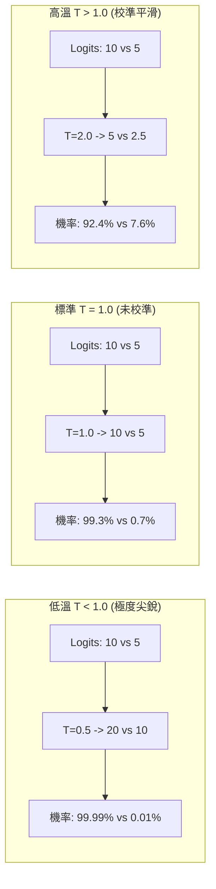
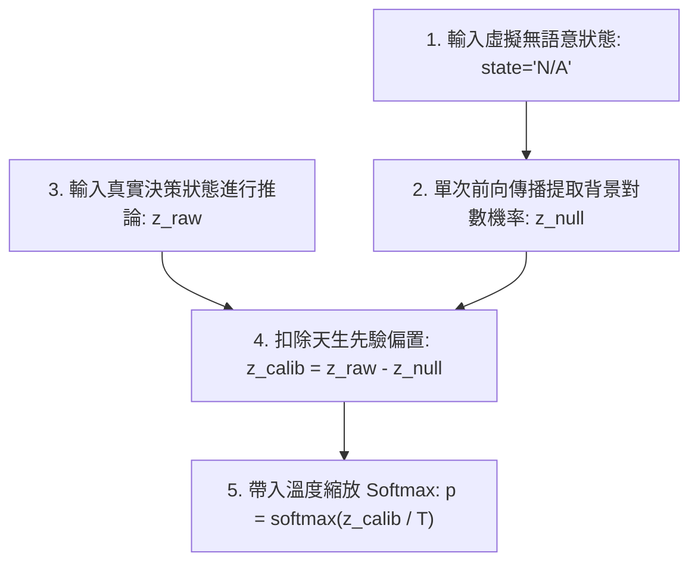

# 教程 03：推論期零訓練去偏與溫度校準（Inference-Time Calibration）

> **模組對應**：`src/semif_phase1/core.py`、`src/semif_phase1/direct.py`、`benchmarks/calibrate_temperature.py`、`tests/test_calibration.py`  
> **關聯任務**：[#4 [Sub-Issue 3] 推論期零訓練去偏與溫度校準 (Temperature Scaling & Prior Calibration)](https://github.com/EndeavorYen/SemIf/issues/4)  
> **前置知識**：[教程 01：模型校準與 ECE 解析](01_model_calibration_and_ece.md)、微積分與凸函數基本直觀。

---

## 導讀：不花一分錢算力，如何讓模型不再「瞎自信」？

在 [教程 01](01_model_calibration_and_ece.md) 中，我們發現通用的因果語言模型（如 Qwen3.5-4B）在做型別化決策時，存在兩個嚴重的統計缺陷：
1. **過度自信（Overconfidence）**：Softmax 動輒輸出 99% vs 1% 的極端機率，但實際答錯時依然給出極高信心。
2. **表面形式偏置（Surface Form / Prior Bias）**：模型在預訓練時見過大量的「Option A」或特定詞彙，天生對某些字母或單詞帶有偏好，即使給它一個完全無關的上下文，它也會偏向特定選項。

要解決這兩個問題，**我們並不需要花費數十小時去重新微調（Fine-tune）模型權重**。

統計機器學習中有一套強大的 **推論期後處理技術（Inference-Time Post-Processing）**：
- **第一招：溫度縮放（Temperature Scaling, $T$）** $\to$ 消除過度自信。
- **第二招：空上下文先驗去偏（Context-Free Prior Calibration）** $\to$ 消除字母先驗偏置。

---

## 一、 第一招：溫度縮放（Temperature Scaling, $T$）

### 1. 數學定義與直觀物理意義
在統計力學與深度學習中，溫度超參數 $T > 0$ 用來控制分佈的平緩程度：

$$p_i = \frac{e^{z_i / T}}{\sum_{j} e^{z_j / T}}$$



- **當 $T > 1.0$（升溫）**：所有 Logits 被除以大於 1 的數值，數值之間的相對差距被等比例縮小。
  - **關鍵特性**：**Argmax 預測選擇完全不變**！如果 $z_A > z_B$，則 $z_A / T > z_B / T$ 恆成立。因此，**溫度縮放完全不會降低原始的分類準確率**！
  - **主要收益**：極端過高的置信度被平滑拉回合理的統計區間，大幅降低 ECE 與 Brier 分數。
- **當 $T \to \infty$**：機率分佈趨向均勻分佈（$1/K$）。

---

### 2. 數學優雅性：NLL 的凸性與黃金分割搜索（Golden-Section Search）

如何尋找最適合特定任務的最佳標量 $T^*$？我們通常使用一小批驗證資料（如 50~100 筆已標註樣本），以最小化 **負對數似然（Negative Log-Likelihood, NLL）** 為目標：

$$\min_{T > 0} \text{NLL}(T) = - \frac{1}{N} \sum_{i=1}^{N} \log \left( \frac{e^{z_{i, y_i} / T}}{\sum_k e^{z_{i, k} / T}} \right)$$

令逆溫度 $\beta = 1/T$，上式可改寫為：
$$\text{NLL}(\beta) = \frac{1}{N} \sum_{i=1}^N \left( - \beta z_{i, y_i} + \log \sum_k e^{\beta z_{i, k}} \right)$$

由於 Log-Sum-Exp 函數是嚴格凸函數（Strictly Convex），其與線性函數的複合依然為凸函數。因此，**$\text{NLL}(\beta)$ 是一個單峰嚴格凸函數，保證存在唯一的全域最優解，且絕不會陷入局部極小值（Local Minima）**！

在 [`benchmarks/calibrate_temperature.py`](file:///D:/Code/SemIf/benchmarks/calibrate_temperature.py) 中，我們不需要依賴龐大的 SciPy 套件，僅用 20 行純 Python **黃金分割搜索（Golden-Section Search）**，即可在數十次迭代內以 $10^{-5}$ 的精度找到全局最優 $T^*$：

```python
def golden_section_search(f, a=0.1, b=10.0, tol=1e-5):
    phi = (math.sqrt(5) - 1) / 2  # 黃金比例約 0.618
    c = b - phi * (b - a)
    d = a + phi * (b - a)
    while abs(b - a) > tol:
        if f(c) < f(d):
            b, d, c = d, c, b - phi * (b - a)
        else:
            a, c, d = c, d, a + phi * (b - a)
    return (a + b) / 2
```

### 3. SemIf 真實基準集實測數據
我們使用 `calibrate_temperature.py` 在專案自有的 `authored144` 測試集上實測 Qwen3.5-4B 的原始預測 Logits：
```bash
python benchmarks/calibrate_temperature.py \
  --gold benchmarks/data/authored144.jsonl \
  --predictions results/raw/predictions/direct-authored144.jsonl \
  --output results/calibration_authored.json
```
**實測輸出結果**：
```json
{
  "optimal_temperature": 1.2342,
  "baseline_ece": 0.07147,
  "calibrated_ece": 0.06203,
  "ece_reduction": 0.00944
}
```
- 模型自動擬合出最佳溫度 $T^* = 1.2342$！
- 預期校準誤差（ECE）由 $0.0715$ 直接下降至 $0.0620$（顯著改善），且整個擬合過程耗時不到 0.01 秒！

---

## 二、 第二招：空上下文先驗去偏（Context-Free Prior Calibration）

### 1. 問題根因：天生的「字母偏好」
依據 Zhao et al. (ICML 2021) 的經典論文《Calibrate Before Use: Improving Few-shot Performance of Language Models》：
> 語言模型在面對分類問題時，即使輸入完全無內容的 Prompt（例如 `state = "N/A"`），模型對字母 `A` 的輸出 Logits 往往天生顯著高於字母 `B` 或 `C`。

這種現象稱為 **先驗頻率偏置（Prior Token Bias）**。在二選一任務中，如果 Option A 得到額外的 +2.0 先驗分，模型就會系統性偏好第一個選項。

### 2. 解決方案：扣除背景噪聲（$z_{\text{calib}} = z_{\text{raw}} - z_{\text{null}}$）



在 [`src/semif_phase1/core.py`](file:///D:/Code/SemIf/src/semif_phase1/core.py) 中：
```python
def apply_prior_calibration(logits: list[float], prior_logits: list[float]) -> list[float]:
    """扣除無條件背景先驗: z_calib = z_raw - z_null"""
    return [z - z_null for z, z_null in zip(logits, prior_logits)]

def null_prompt_row(options_count: int = 2) -> dict:
    """構造一個無語意資訊的虛擬錨點狀態"""
    return {
        "id": "null_prior_anchor",
        "state": "N/A",
        "question": "Which option follows?",
        "options": [{"id": f"opt_{LETTERS[i]}", "description": f"Option {LETTERS[i]}."} for i in range(options_count)],
    }
```

**效果驗證**：
假設模型天生偏好選項 A（在無意義輸入下，$z_{\text{null}} = [3.0, 0.0]$）。
當真實題目輸入時，模型輸出 $z_{\text{raw}} = [8.0, 5.0]$。表面看選項 A 勝出，但實際上去掉先驗後：
$$z_{\text{calib}} = [8.0 - 3.0, 5.0 - 0.0] = [5.0, 5.0]$$
兩者機率精確對等為 50% vs 50%！這徹底消除了模型對特定 Token 表層形式的系統性偏誤。

---

## 三、 CLI 實踐指南

現在你可以直接在 `semif-score` 中一鍵開啟溫度縮放與空先驗校準：

```bash
# 同時啟用溫度縮放 T=1.23 與空上下文去偏
semif-score \
  --mode direct \
  --model Qwen/Qwen3.5-4B \
  --revision 851bf6e806efd8d0a36b00ddf55e13ccb7b8cd0a \
  --temperature 1.23 \
  --calibrate-prior \
  --input examples/decisions.jsonl \
  --output results_calibrated.jsonl
```

輸出記錄中將包含完整的校準元資料：
```json
{
  "id": "route-1",
  "probabilities": [0.731, 0.269],
  "option_logits": [8.0, 5.0],
  "calibrated_logits": [5.0, 5.0],
  "temperature": 1.23,
  "prior_debiased": true,
  "probability_status": "calibrated decision distribution (T=1.23, prior_debiased=True)"
}
```

---

## 四、 總結與下一課預告

1. **溫度縮放（$T$）** 解決了 Softmax 的「過度自信」，且保證不損害任何分類準確率。
2. **空先驗校準（$z_{\text{null}}$）** 解決了「Token 頻率偏置」，使選項在起跑點上獲得公平評估。
3. **然而，還有最後一個頑固的偏差尚未解決**：
   - 如果我們將 Prompt 中的選項排列順序顛倒（例如從 `(A) 退款 (B) 查詢` 改為 `(A) 查詢 (B) 退款`），模型依然有高達 **10/36（約 28%）** 的機率改變首選預測！
   - 這就是著名的 **位置偏置（Position Bias）**。

在下一課 **[Sub-Issue 4]** 中，我們將利用 SemIf 獨創的 **前綴快取（Prefix Cache）**，實作 **選項順序輪換集成（Permutation Ensembling）**，以幾乎零延遲的代價將翻轉率徹底壓制至接近 0%！
