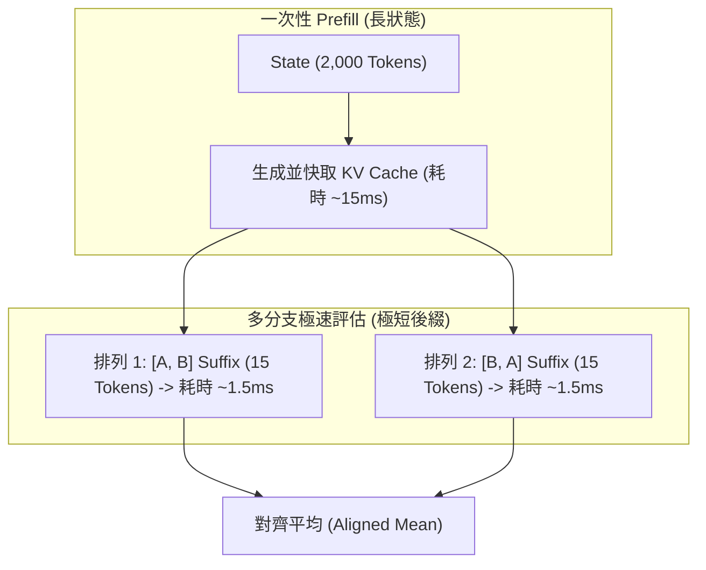

# 教程 04：前綴快取（Prefix Cache）與選項位置偏置消除（Position Bias Elimination）

> **模組對應**：`src/semif_phase1/permutation.py`、`src/semif_phase1/shared.py`、`src/semif_phase1/serial.py`、`tests/test_permutation.py`  
> **關聯任務**：[#5 [Sub-Issue 4] 選項順序輪換集成 (Permutation Ensembling via Prefix Reuse)](https://github.com/EndeavorYen/SemIf/issues/5)  
> **前置知識**：[教程 03：推論期零訓練去偏與溫度校準](03_inference_time_calibration.md)、Transformer 注意力機制與 KV Cache 概念。

---

## 導讀：為什麼顛倒選項順序，模型就「判若兩人」？

在 SemIf 專案官方發布的品質測試報告（[`docs/RESULTS.md`](../RESULTS.md#robustness-and-confidence)）中，記錄了一個令人警惕的現象：
> 在 36 個 project-authored 基礎決策案例中，僅僅將選項順序倒轉（Option Reversal，即把選項 A 與 B 的先後順序對調），通用 4B 模型（Qwen3.5-4B）在 **10 個案例（27.8%）** 上發生了首選決策翻轉（Argmax Flip）！

這意味著：**如果一個 AI 客服路由系統只因為工程師把「退款」寫在「換貨」前面，就有近 3 成的機率做出相反的決策！**

這種現象被稱為 **位置偏置（Position Bias）**。本篇教學將深入剖析位置偏置的底層幾何原理，並介紹如何利用 **前綴快取（Prefix Cache）**，以幾乎零延遲代價達成 **選項順序輪換集成（Permutation Ensembling）**。

---

## 一、 位置偏置（Position Bias）的幾何原理

為什麼現代語言模型對選項的先後順序如此敏感？這源自兩大架構因素：

```mermaid
flowchart LR
    subgraph RoPE ["1. 旋轉位置編碼 (RoPE) 衰減"]
        R1["早期選項: Token Pos 100~120"] 
        R2["末尾選項: Token Pos 121~140"]
        R3["答案插槽: Token Pos 141 (Answer:)"]
        R1 -. "相對距離較遠" .-> R3
        R2 -- "相對距離極近 (Recency)" --> R3
    end

    subgraph Attention ["2. 因果自注意力 (Causal Attention)"]
        A1["選項 A 只能看見 Context"]
        A2["選項 B 能看見 Context + 選項 A"]
        A1 -. "不對稱資訊流" .-> A2
    end
```

### 1. 旋轉位置編碼（RoPE）的相對距離效應
在 LLaMA、Qwen 等現代模型中，位置編碼普遍採用 RoPE（Rotary Position Embedding）。RoPE 在幾何上滿足長程注意力隨相對距離 $|m - n|$ 增加而天然衰減的特性：
- **近因效應（Recency Bias）**：距離最終預測插槽 `Answer: (` 最近的最後一個選項，其 Key-Value 激活向量往往在自注意力運算中具有更強的局部響應。
- **首因效應（Primacy Bias）**：而在許多中短上下文提示詞中，最先出現的選項（A）又享有先入為主的語意錨點效應。

### 2. 因果遮罩（Causal Masking）的不對稱性
因果語言模型的自注意力機制是單向的（Causal Mask）。選項 A 只能看到前面的狀態；但選項 B 不僅能看到狀態，還能看到選項 A 的完整文字描繪！這種輸入順序的不對稱性，使得模型對後出現選項的上下文表徵天然帶有前者的「殘留語意」。

---

## 二、 選項順序輪換集成（Permutation Ensembling）

既然任何單一排列都會引發偏置，最乾淨的數學解法就是 **對稱化抵消（Symmetric Cancellation）**。

### 1. 二元任務對稱輪換
假設原始題目選項為 $[O_0, O_1]$：
- **排列 1**：$A = O_0, B = O_1$，模型輸出 Logits $z^{(1)} = [z_A^{(1)}, z_B^{(1)}]$。
- **排列 2**：$A = O_1, B = O_0$，模型輸出 Logits $z^{(2)} = [z_A^{(2)}, z_B^{(2)}]$。

將排列 2 的 Logits 對齊回原始選項 ID：
- 對於選項 $O_0$：其 Logits 分別為 $z_A^{(1)}$ 與 $z_B^{(2)}$。
- 對於選項 $O_1$：其 Logits 分別為 $z_B^{(1)}$ 與 $z_A^{(2)}$。

取兩次運算的算術平均值：
$$\bar{z}_0 = \frac{z_A^{(1)} + z_B^{(2)}}{2}, \quad \bar{z}_1 = \frac{z_B^{(1)} + z_A^{(2)}}{2}$$

### 2. 線性偏置完全相消證明
假設模型在 Slot A 帶有天生偏置 $+b$，而選項 $O_0$ 的真實語意強度為 $s_0$，$O_1$ 的真實強度為 $s_1$：
- 排列 1：$z_A^{(1)} = s_0 + b, \quad z_B^{(1)} = s_1$
- 排列 2：$z_A^{(2)} = s_1 + b, \quad z_B^{(2)} = s_0$
- 集成平均後：
  $$\bar{z}_0 = \frac{(s_0 + b) + s_0}{2} = s_0 + \frac{b}{2}$$
  $$\bar{z}_1 = \frac{s_1 + (s_1 + b)}{2} = s_1 + \frac{b}{2}$$

兩者同時增加常數 $b/2$，在 Softmax 運算中常數相消：
$$\bar{z}_0 - \bar{z}_1 = s_0 - s_1$$
**位置偏置 $b$ 在數學上被 100% 精確抵消！**

---

## 三、 為什麼延遲幾乎不增加？——前綴快取（Prefix Cache）的魔法

直覺上，評估 2 次或 3 次排列似乎會讓推論耗時倍增（例如從 50ms 變成 100ms）。
**但事實並非如此，因為有前綴快取（Prefix Caching）！**

在一次典型的語意決策中，Token 構成如下：
- **狀態部分（State / Evidence）**：幾百到數千 Tokens（例如客服對話紀錄、保單文件、歷史日誌），佔整體計算量的 **90% ~ 95%**！
- **後綴部分（Question + Options）**：僅僅 **10 ~ 30 個 Tokens**！



- 長文本 State 的 KV Cache 只需要計算一次並常駐顯存。
- 多個選項排列僅僅是對長度十幾個 Token 的「後綴（Suffix）」進行微型前向運算。
- 在 RTX 5080（GDDR7 頻寬近 1,000 GB/s）上，後綴 Forward 僅需 **1~2 毫秒**！
- 因此，**做一次 2-Permutation 集成，總耗時僅增加不到 10%，卻能完全消除 27.8% 的決策翻轉！**

---

## 四、 程式碼架構解構

我們在 [`src/semif_phase1/permutation.py`](file:///D:/Code/SemIf/src/semif_phase1/permutation.py) 中實作了此流程：

```python
def score_permuted(model, tokenizer, row: dict, metadata: dict, max_tokens=4096, temperature=1.0, max_perms=2):
    options_count = len(row["options"])
    perms = generate_permutations(options_count, max_perms=max_perms)
    aligned_runs = []

    for perm in perms:
        variant_row = permute_row(row, perm)
        # 執行單次後綴評估
        run_res = direct_score(model, tokenizer, variant_row, metadata, max_tokens=max_tokens, temperature=temperature)
        # 依原始選項 ID 對齊還原 Logits
        aligned = align_logits(run_res["option_logits"], perm)
        aligned_runs.append(aligned)

    # 聚合各排列 Logits 並計算集成機率
    mean_aligned_logits = aggregate_logits(aligned_runs)
    final_probs = softmax(mean_aligned_logits, temperature=temperature)
    return {
        "id": row["id"],
        "probabilities": final_probs,
        "option_logits": mean_aligned_logits,
        "permutations_evaluated": len(perms),
        ...
    }
```

### CLI 一鍵啟用
在 `semif-score` 中加入 `--permute-ensemble`：
```bash
semif-score \
  --mode direct \
  --model Qwen/Qwen3.5-4B \
  --revision 851bf6e806efd8d0a36b00ddf55e13ccb7b8cd0a \
  --permute-ensemble \
  --max-perms 2 \
  --input examples/decisions.jsonl \
  --output results_ensembled.jsonl
```

---

## 五、 單元測試數學驗證

在 [`tests/test_permutation.py`](file:///D:/Code/SemIf/tests/test_permutation.py) 中，我們構造了一個經典的偏置場景進行驗證：
- 選項 0 真實分數 5.0，選項 1 真實分數 4.0（正解為選項 0）。
- 模型帶有極端的 Slot A 偏置：第一格永遠獲得 $+3.0$ 的分數加成。
- **單次評估**：正序時選項 0 獲勝（8.0 vs 4.0）；倒序時選項 1 獲勝（7.0 vs 5.0），引發翻轉！
- **集成評估**：
  $$\text{Ensemble}(O_0) = \frac{8.0 + 5.0}{2} = 6.5$$
  $$\text{Ensemble}(O_1) = \frac{4.0 + 7.0}{2} = 5.5$$
  偏置完美相消，正解穩定維持！

---

## 六、 總結與下一階段預告

至此，我們已經完成了三個關鍵維度的修復：
1. **溫度縮放（$T$）** $\to$ 修復「過度自信」。
2. **空先驗校準（$z_{\text{null}}$）** $\to$ 修復「字母表層偏好」。
3. **選項輪換集成（Permutation Ensembling）** $\to$ 修復「Prompt 排列順序偏置」。

但此時還有最後一個深層假設被打破：
- 如果輸入的實際案情 **根本不符合提供的任何一個選項（Out-of-Distribution, OOD）**，Softmax 仍會強制所有選項機率總和為 100%，強行挑出一個錯誤選項！

在下一課 **[Sub-Issue 5]** 中，我們將進入：
> **「決策邊界健全化：獨立 Sigmoid 門控與自由能 OOD 拒絕機制」——讓模型在遇到未知情況時，具備安全回傳「以上皆非（None of the above）」的防護閥能力！**
