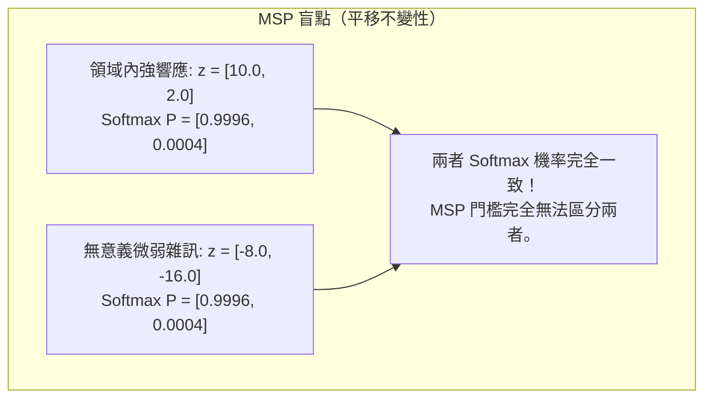
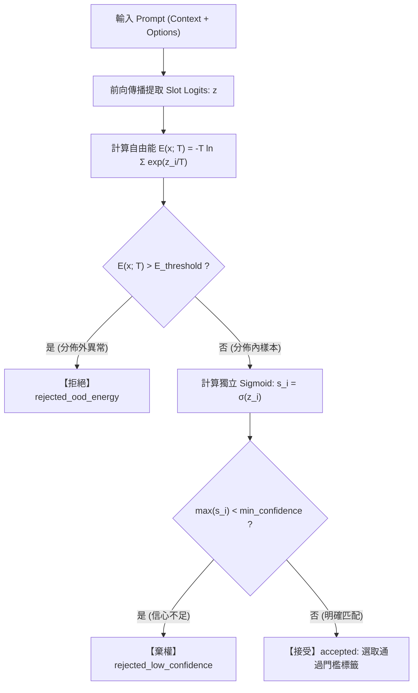

# 教程 05：開放世界拒絕與基於自由能的 OOD 偵測（Open-World Gating & Energy-Based OOD Detection）

> **模組對應**：`src/semif_phase1/gating.py`、`src/semif_phase1/cli.py`、`tests/test_gating.py`  
> **關聯任務**：[#6 [Sub-Issue 5] 開放世界拒絕與基於能量的 OOD 偵測 (Open-World Gating & Energy OOD Rejection)](https://github.com/EndeavorYen/SemIf/issues/6)  
> **前置知識**：[教程 03：推論期零訓練去偏與溫度校準](03_inference_time_calibration.md)、[教程 04：前綴快取與選項位置偏置消除](04_prefix_cache_and_position_bias.md)、能量模型（Energy-Based Models, EBM）基礎概念。

---

## 導讀：為什麼 Softmax 在面對「未知」時總是自信胡扯？

在封閉世界假設（Closed-World Assumption）下，分類系統假設真實答案**必然存在於給定的選項集合中**。例如：
- 題目：「這家餐廳好不好吃？」
- 選項：A. 好吃 / B. 不好吃

如果用戶傳入一段完全無關的語意（Out-of-Distribution, OOD），例如：
> 「今天台北捷運文湖線有沒有誤點？」

傳統使用 $\text{Softmax}$ 的決策系統會做出什麼反應？
因為 $\text{Softmax}$ 的數學定義強制所有類別的機率和必須為 1：
$$\sum_{i=1}^K P(y = i \mid x) = \sum_{i=1}^K \frac{e^{z_i}}{\sum_{j=1}^K e^{z_j}} = 1.0$$

即便模型對兩個選項都毫無概念、未經微調（Logits $z_A = -2.1, z_B = -2.0$），$\text{Softmax}$ 依然會給出 $P(B) \approx 52.5\%, P(A) \approx 47.5\%$，系統依然會輸出決策 `B`。更嚴重的是，只要其中一個 Logit 稍有雜訊波動，最大 Softmax 機率（Maximum Softmax Probability, MSP）很容易膨脹至 80% 以上，導致系統在面對惡意注入、胡言亂語或超出業務範圍的情境時**盲目下單或觸發不可逆操作**。

要讓語意決策引擎具備工業級可靠度，系統必須具備「**知道自己不知道（Know What It Doesn't Know）**」的能力——即**開放世界拒絕門控（Open-World Gating）**。

---

## 一、 核心理論：為什麼不能只靠 Softmax 門檻？

直覺上，大家會想：「設定一個門檻，若 $\max_i P(i \mid x) < 0.8$ 就拒絕，不行嗎？」

答案是：**不行，MSP 在數學上是平移不變的（Scale/Shift Invariant），無法反映輸入數據的絕對邊緣密度。**



在上述例子中：
- 案例 1 的 Logits 高達 $10.0$，代表模型內部神經元被強烈激活，高度契合分佈內語意；
- 案例 2 的 Logits 只有 $-8.0$，代表神經元幾乎全處於抑制狀態，模型根本沒見過該語意。

然而，因為 $\text{Softmax}(\mathbf{z} + c) = \text{Softmax}(\mathbf{z})$，Softmax **抹殺了絕對能量資訊**！

---

## 二、 基於自由能（Energy-Based）的 OOD 偵測原理

為了解決 Softmax 丟失絕對尺度資訊的缺陷，Liu et al. (NeurIPS 2020) 提出了基於自由能（Free Energy）的 OOD 偵測架構。

### 1. 自由能的數學推導
在玻爾茲曼分佈（Boltzmann Distribution）的能量模型觀點下，輸入 $x$ 與類別 $y$ 的聯合機率分佈可定義為：
$$p(x, y) = \frac{e^{-E(x, y)/T}}{Z}$$
其中 $Z = \int \sum_y e^{-E(x, y)/T} dx$ 為配分函數（Partition Function）。

將模型對類別 $y_i$ 的輸出 Logit 視為負能量，即 $-E(x, y_i) = z_i(x)$。對類別空間進行邊緣化邊緣積分（Marginalize），輸入樣本 $x$ 的邊緣密度（Marginal Density）為：
$$p(x) = \sum_{i=1}^K p(x, y_i) = \frac{\sum_{i=1}^K e^{z_i(x)/T}}{Z} = \frac{e^{-E(x; T)/T}}{Z}$$

因此，自由能（Helmholtz Free Energy）$E(x; T)$ 定義為：
$$E(x; T) = -T \cdot \log \sum_{i=1}^K e^{z_i(x) / T}$$

### 2. 自由能的幾何特性
注意到：
1. **分佈內樣本（In-Distribution, ID）**：模型在某些插槽上有極高 Logits（例如 $z_1 = 8.5$），$\sum e^{z_i/T}$ 很大，因此 $-T \log \sum e^{z_i/T}$ 是**負的大值（低自由能）**。
2. **分佈外異常（Out-of-Distribution, OOD）**：模型在所有插槽上均無特徵響應（例如 $z_i \le -2.0$），$\sum e^{z_i/T}$ 趨近於 0，因此 $-T \log \sum e^{z_i/T}$ 是**較大正值或接近零（高自由能）**。

透過設定能量閾值 $E_{th}$，我們能在不修改模型權重的情況下，以 $\mathcal{O}(K)$ 的計算代價實現場景過濾：
$$\text{Is\_OOD}(x) \iff E(x; T) > E_{th}$$

---

## 三、 獨立 Sigmoid 多標籤門控架構

在許多真實商業決策場景中，單一決策互斥假設並不成立，例如：
- 「這封郵件是否為投訴？是否要求退款？」 $\rightarrow$ 可能兩者皆是，也可能兩者皆非。
- 「這筆交易是否疑似盜刷？」 $\rightarrow$ 如果都不是正常交易類別，不應強行歸類為任一合法類別。

SemIf 設計了雙軌評估機制：



### 1. 數值穩定的 Sigmoid 實作
為了防止極端 Logits 造成浮點數上溢或下溢，`src/semif_phase1/gating.py` 採用了數值平移實作：
$$\sigma(z) = \begin{cases} \frac{1}{1 + e^{-z}} & \text{if } z \ge 0 \\ \frac{e^z}{1 + e^z} & \text{if } z < 0 \end{cases}$$

### 2. 決策門控狀態機
`gate_decision()` 輸出三種語意狀態：
1. **`accepted`**：通過能量安全檢查，且最高選項置信度高於 `min_confidence`。
2. **`rejected_low_confidence`**：雖然分佈能量在正常範圍內，但多個選項模糊難辨，模型選擇棄權（Abstain）。
3. **`rejected_ood_energy`**：自由能超過安全閾值，直接攔截未定義的異常輸入。

---

## 四、 程式碼導讀與實戰

### 1. 核心核心函數實作 (`src/semif_phase1/gating.py`)

```python
import math

def compute_free_energy(logits: list[float], temperature: float = 1.0) -> float:
    """計算輸入 Logits 的 Helmholtz Free Energy。"""
    max_l = max(logits)
    # LogSumExp 平移防溢位
    lse = max_l / temperature + math.log(sum(math.exp((l - max_l) / temperature) for l in logits))
    return -temperature * lse

def gate_decision(
    logits: list[float],
    labels: list[str],
    min_confidence: float = 0.5,
    energy_threshold: float | None = None,
    temperature: float = 1.0,
) -> dict:
    """開放世界拒絕門控邏輯"""
    energy = compute_free_energy(logits, temperature=temperature)
    if energy_threshold is not None and energy > energy_threshold:
        return {
            "status": "rejected_ood_energy",
            "free_energy": energy,
            "selected": [],
        }
    ...
```

### 2. 命令列工具（CLI）使用範例

在 CLI 中啟用開放世界門控與能量過濾：
```bash
python -m semif_phase1.cli \
  --manifest data/test_sample.jsonl \
  --mode direct \
  --gating \
  --min-confidence 0.6 \
  --energy-threshold -1.5
```

當遇到無關輸入時，輸出 JSON 將記錄：
```json
{
  "prediction": null,
  "confidence": 0.231,
  "gating": {
    "status": "rejected_ood_energy",
    "free_energy": 2.418,
    "selected": []
  }
}
```

---

## 五、 小結與後續路徑

| 機制 | 作用 | 計算代價 |
| :--- | :--- | :--- |
| **自由能 OOD 偵測** | 攔截超出業務分佈的異常輸入 | $\mathcal{O}(K)$ 僅數個 slot logits 的 LogSumExp |
| **獨立 Sigmoid 門控** | 支援多標籤選取、避免封閉互斥假設 | $\mathcal{O}(K)$ 單純逐項 Sigmoid |
| **棄權門檻（Abstention）** | 消除低信心強制猜測，提升端到端準確率 | $\mathcal{O}(1)$ 純標量閾值比對 |

至此，我們已經完備了推論期決策的所有演算法保護層（ECE 校準、先驗去偏、順序輪換、開放世界門控）。接下來，我們將邁入專案的**硬體算力加速階段**：
- 在 **Sub-Issue 6** 中，我們將針對 RTX 5080 與大規模詞表架構，深入剖析並實作 **切片語言模型頭部優化（Sliced LM Head Optimization）**，跳過 15 萬維度的全詞表矩陣乘法！
