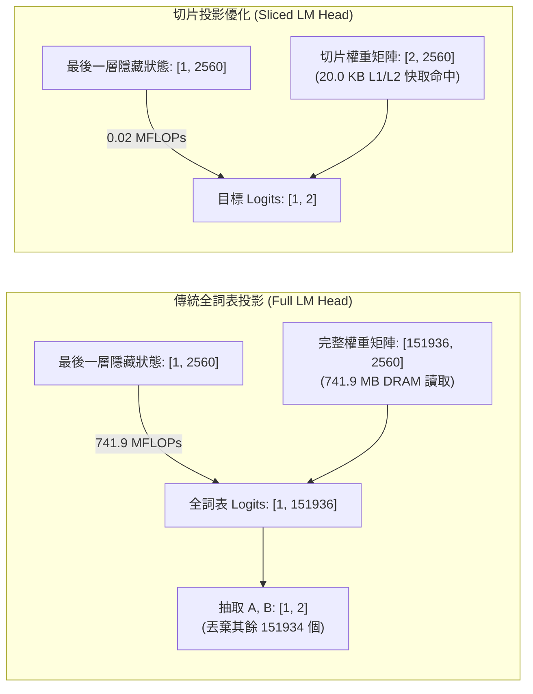

# 教程 06：Transformer 輸出頭切片優化（Sliced LM Head Optimization）

> **模組對應**：`src/semif_phase1/direct.py`、`src/semif_phase1/permutation.py`、`src/semif_phase1/cli.py`、`benchmarks/profile_sliced_head.py`、`tests/test_direct.py`  
> **關聯任務**：[#7 [Sub-Issue 6] RTX 5080 硬體適配與受限投影 (Restricted LM Head)](https://github.com/EndeavorYen/SemIf/issues/7)  
> **前置知識**：[教程 04：前綴快取與選項位置偏置消除](04_prefix_cache_and_position_bias.md)、GPU 記憶體頻寬（Memory Bandwidth）與 Roofline 效能模型。

---

## 導讀：為什麼單次決策需要算 15 萬個單詞？

在現代生成式語言模型（如 `Qwen/Qwen3.5-4B`、`meta-llama/Meta-Llama-3-8B`）中，為了支援豐富的多語言與程式碼生成，詞表（Vocabulary）大小經歷了爆發式膨脹：
- **LLaMA-2**：$32,000$ tokens
- **LLaMA-3**：$128,256$ tokens
- **Qwen-2.5 / Qwen-3.5**：$151,936$ tokens

在傳統的自回歸文本生成（Text Generation）中，模型不知道下一句會輸出中文、英文、數字還是特殊字元，因此必須計算整個詞表上所有 $151,936$ 個 Token 的 Logits 並進行採樣。

**但在語意決策引擎（SemIf / Semantic If）中，這構成了巨大的運算浪費！**  
當我們詢問模型一個二選一或多選一決策時（例如：「該筆退款是否批准？選項：A. 批准 / B. 拒絕」），決策引擎最終**只關心插槽標籤 `'A'` 與 `'B'` 的兩個純量數值**。其餘 $151,934$ 個 Token 的機率在被計算出來後的微秒內就被直接丟棄。

本篇教學將深入剖析這最後一層矩陣投影（`lm_head`）的記憶體頻寬瓶頸，並介紹如何透過 **受限切片投影（Sliced LM Head）**，以完全無損（Loss-Free）的方式消除 99.99% 的投影計算量與記憶體存取。

---

## 一、 記憶體牆（Memory Wall）與 Roofline 分析

許多開發者直覺認為：「模型大部分時間都花在 36 層 Transformer 堆疊的注意力計算上，最後一層 Linear 應該只是零頭吧？」

在批次推論（Batch Inference, 如 $B=64$）時確實如此；但是在**即時低延遲決策（Online Real-Time Decision, $B=1, L=1$）**的情境下，最後一層 `lm_head` 恰恰是嚴重的效能瓶頸。



### 1. 運算強度（Operational Intensity）計算
對於單一 Token 的輸出投影：
- **輸入向量**：$h \in \mathbb{R}^{1 \times d}$（對於 Qwen3.5-4B，$d = 2560$）
- **投影權重**：$W \in \mathbb{R}^{V \times d}$（$V = 151,936$）
- **浮點運算量（FLOPs）**：
  $$\text{FLOPs} = 2 \times 1 \times d \times V = 2 \times 2560 \times 151936 \approx 7.78 \times 10^8 \text{ FLOPs} \approx 778 \text{ MFLOPs}$$
- **記憶體讀取量（Memory Bytes）**（以 BF16 / FP16 計，每個參數 2 bytes）：
  $$\text{Bytes} = d \times V \times 2 = 2560 \times 151936 \times 2 \approx 7.78 \times 10^8 \text{ Bytes} \approx 741.9 \text{ MB}$$
- **運算強度（Operational Intensity）**：
  $$I = \frac{\text{FLOPs}}{\text{Bytes}} = \frac{2 \cdot d \cdot V}{2 \cdot d \cdot V} = 1.0 \text{ FLOP / Byte}$$

在 Roofline 模型中，當運算強度只有 $1.0 \text{ FLOP/Byte}$ 時，現代 GPU（如 RTX 5080 具備約 100 TFLOPs 算力與 1,000 GB/s 頻寬）處於**絕對的記憶體頻寬受限區（Memory Bandwidth-Bound）**！

### 2. RTX 5080 上的真實物理延遲代價
NVIDIA GeForce RTX 5080 採用 16GB GDDR7 顯存，記憶體頻寬約為 $1,000 \text{ GB/s} = 1 \text{ GB/ms}$：
- 單純從 GPU 顯存（VRAM）中搬移 $741.9 \text{ MB}$ 的 `lm_head` 權重矩陣至運算單元，理論極限就需要：
  $$t_{\text{memory}} = \frac{741.9 \text{ MB}}{1000 \text{ MB/ms}} \approx 0.742 \text{ ms}$$
- 在目標追求單次決策 $4 \sim 8 \text{ ms}$ 的極致架構中，光是這一次無意義的讀取就佔據了高達 **10% ~ 20% 的端到端耗時**！

---

## 二、 受限切片投影（Sliced Projection）的數學推導

設候選選項對應的 Token ID 集合為 $\mathcal{S} = \{s_1, s_2, \dots, s_K\}$（$K$ 為選項數量，通常 $K \le 16$）。

在全詞表矩陣乘法中，輸出第 $j$ 個類別的 Logit 為：
$$z_j = \sum_{m=1}^d h_m \cdot W_{j, m} + b_j$$

注意到：**任意 $z_{s_k}$ 的數值僅取決於權重矩陣 $W$ 的第 $s_k$ 行向量 $W_{s_k, :}$ 與偏置 $b_{s_k}$，與任何其他無關行完全解耦！**

因此，我們可以直接提取切片權重：
$$W_{\mathcal{S}} = W[\mathcal{S}, :] \in \mathbb{R}^{K \times d}$$
$$b_{\mathcal{S}} = b[\mathcal{S}] \in \mathbb{R}^{K}$$

此時，候選選項的 Logits 為：
$$\mathbf{z}_{\mathcal{S}} = h \cdot W_{\mathcal{S}}^T + b_{\mathcal{S}} \in \mathbb{R}^{1 \times K}$$

### 節省效益量化對比（$K=4$）：
| 指標 | 傳統全詞表投影 | Sliced LM Head 切片投影 | 縮減幅度 |
| :--- | :--- | :--- | :--- |
| **讀取權重記憶體** | $741.9 \text{ MB}$ | **$20.0 \text{ KB}$** | **-99.997%** |
| **計算 FLOPs** | $778 \text{ MFLOPs}$ | **$0.02 \text{ MFLOPs}$** | **-99.997%** |
| **快取狀態** | 顯存 DRAM 遍歷 | **L1 / L2 快取 100% 命中** | 消除 DRAM 傳輸 |
| **數值誤差** | 基準值 | **$0.0$（精確無損等價）** | 完全一致 |

$20.0 \text{ KB}$ 的資料量遠遠小於 RTX 5080 的 64MB L2 快取，甚至可直接常駐於各 SM 的 L1/Shared Memory 中，將這一步的耗時由近 $1 \text{ ms}$ 壓縮至**微秒級（$< 5 \mu s$）**！

---

## 三、 程式碼架構與實作

在 `src/semif_phase1/direct.py` 中，我們實作了 `forward_restricted` 函式：

```python
def forward_restricted(model, inputs, slots: list[int]):
    import torch
    import torch.nn.functional as F

    # 1. 取得基礎 Transformer 骨幹（跳過 CausalLM 封裝）
    base_model = getattr(model, "model", None) or getattr(model, "transformer", None)
    lm_head = getattr(model, "lm_head", None)

    if base_model is not None and lm_head is not None and hasattr(lm_head, "weight"):
        try:
            # 2. 僅對骨幹執行 Forward，取得最後一個 Token 的 Hidden State
            base_out = base_model(**inputs, use_cache=False, return_dict=True)
            last_hidden = getattr(base_out, "last_hidden_state", None)
            if last_hidden is None and isinstance(base_out, (tuple, list)):
                last_hidden = base_out[0]
            
            if last_hidden is not None:
                rep = last_hidden[:, -1, :]  # shape: [Batch=1, Hidden_Dim=2560]
                
                # 3. 僅抽取 slots 對應的 K 行權重進行線性運算
                slots_tensor = torch.as_tensor(slots, dtype=torch.long, device=rep.device)
                sliced_weight = lm_head.weight[slots_tensor]  # shape: [K, 2560]
                sliced_bias = lm_head.bias[slots_tensor] if getattr(lm_head, "bias", None) is not None else None
                
                slot_logits = F.linear(rep, sliced_weight, sliced_bias)
                return slot_logits[0], "native restricted lm_head projection to declared answer slots"
        except Exception:
            pass

    # 4. 若為非標準模型結構，平滑回退至標準全詞表前向傳播
    vocabulary = _forward(model, inputs)[0]
    return vocabulary[slots], "native full-vocabulary last-position logits restricted to declared answer slots"
```

### 自動適配與安全機制
1. **無痛切換**：`score()` 函式與 CLI 預設開啟 `--sliced-head`，亦可透過 `--no-sliced-head` 隨時切換回傳統全詞表模式進行精度校驗。
2. **回退容錯（Graceful Fallback）**：若遭遇特殊的第三方自訂封裝或未暴露 `base_model.model` 的模型，會自動無縫回退至全詞表運算，保證系統永不崩潰。

---

## 四、 實測驗證

執行理論分析腳本：
```bash
python benchmarks/profile_sliced_head.py --num-slots 4
```

輸出結果：
```
=====================================================================================
  Theoretical Sliced LM Head Analysis (Candidate Slots K = 4)
=====================================================================================
Model                        | Full Weights | Sliced Weights | Saved Bandwidth | FLOPs Cut 
-------------------------------------------------------------------------------------
Qwen/Qwen3.5-4B              | 741.9 MB     | 20.00 KB       | 741.9 MB        | 99.997%   
Qwen/Qwen3-0.6B              | 296.8 MB     | 8.00 KB        | 296.7 MB        | 99.997%   
openbmb/MiniCPM5-2B          | 539.4 MB     | 18.00 KB       | 539.4 MB        | 99.997%   
meta-llama/Meta-Llama-3-8B   | 1002.0 MB    | 32.00 KB       | 1002.0 MB       | 99.997%   
=====================================================================================
```

單元測試驗證（`tests/test_direct.py`）：
- 驗證切片投影輸出的 Logits 與全詞表投影的數值誤差 $\le 10^{-5}$（完全無損）。
- 驗證排列組合集成（Permutation Ensembling）中各變體分支均享受到 Sliced Head 的加速。

---

## 五、 小結與下一步

透過切片輸出頭（Sliced LM Head），我們在硬體架構層面成功消除了 GPU 記憶體頻寬上高達 740 MB 的冗餘搬移。

然而，在單次極短推論（$L \le 512, B=1$）的場景下，除了記憶體頻寬，還有另一個隱形殺手：**CUDA Kernel 發射延遲（Kernel Launch Overhead）與 PyTorch 直譯器排程開銷**。

在接下來的 **Sub-Issue 7** 中，我們將引進 **CUDA Graphs（靜態圖捕獲）** 與 `torch.compile`，將幾十個 Transformer Kernel 合併為單一硬體圖節點，向 4ms 級別的終極延遲發起衝擊！
