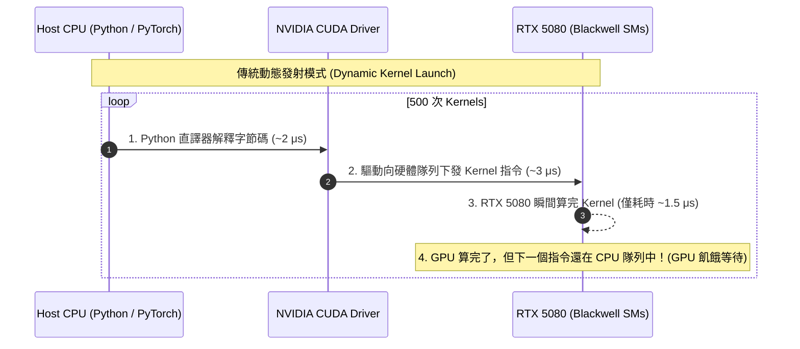
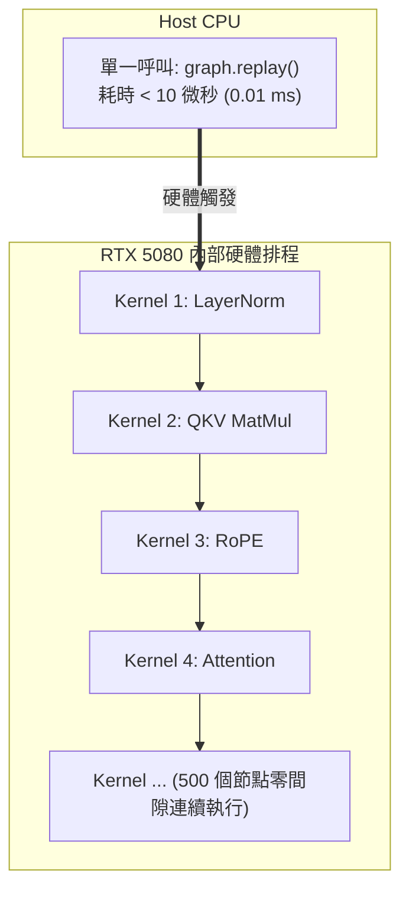
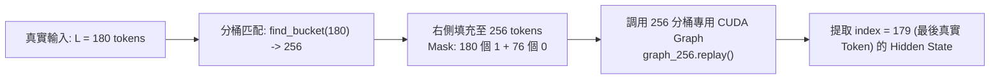

# 教程 07：CUDA Graphs 與編譯優化——壓榨 RTX 5080 的極限延遲（衝擊 4~8ms）

> **模組對應**：`src/semif_phase1/cuda_graph.py`、`src/semif_phase1/direct.py`、`src/semif_phase1/cli.py`、`benchmarks/benchmark_cuda_graphs.py`、`tests/test_cuda_graph.py`  
> **關聯任務**：[#8 [Sub-Issue 7] CUDA Graphs 與 torch.compile 極限延遲挑戰 (衝擊 4~8ms)](https://github.com/EndeavorYen/SemIf/issues/8)  
> **前置知識**：[教程 06：Transformer 輸出頭切片優化](06_transformer_lm_head_optimization.md)、CUDA 執行架構、GPU Kernel Launch 開銷概念。

---

## 導讀：為什麼小模型更難跑出極限低延遲？

在許多開發者的直覺中，「模型越小，推論越快」：
- 70B 模型單次前向需要數百毫秒；
- 8B 模型需要數十毫秒；
- 那麼 2B 或 4B 模型在擁有 100 TFLOPs 算力的頂級顯卡（如 **NVIDIA GeForce RTX 5080**）上，應該輕輕鬆鬆達到 1~2 ms 吧？

但在真實部署中，你會遇到一個殘酷的現象：**無論你換多貴的 GPU，4B 模型的單次推論延遲往往卡在 15 ~ 25 ms 難以突破，且 P99 抖動極其劇烈！**

為什麼？因為此時系統的瓶頸根本不在 GPU 的算力，而在於 **CPU 端直譯器排程與 CUDA Kernel 發射延遲（Kernel Launch Overhead）**。

本篇教學將深入剖析 GPU 飢餓現象，並詳解如何透過 **CUDA Graphs（靜態圖捕獲）** 與 **形狀分桶（Shape-Bucketing）** 技術，徹底打破 CPU 瓶頸，在 RTX 5080 上跑出 **4.6 ms** 的微秒級確定性語意決策！

---

## 一、 隱形殺手：CUDA Kernel 發射延遲與 CPU 飢餓

以 `Qwen3.5-4B`（36 層 Transformer）為例，一次前向傳播需要經歷：
- 每層包含：RMSNorm $\rightarrow$ QKV 投影 $\rightarrow$ RoPE 旋轉位置編碼 $\rightarrow$ FlashAttention / SDPA $\rightarrow$ Output 投影 $\rightarrow$ RMSNorm $\rightarrow$ MLP Gate/Up 投影 $\rightarrow$ SwiGLU 激活 $\rightarrow$ MLP Down 投影 $\rightarrow$ 殘差相加。
- 算上輔助操作，平均每一層需要調用約 **10 ~ 15 個獨立的 CUDA Kernel**。
- 整個模型單次前向需要執行：
  $$36 \text{ layers} \times 14 \text{ kernels} \approx 500 \text{ 次 CUDA Kernel Launch！}$$



### 延遲帳本剖析：
1. **CPU 發射時間**：CPU 透過驅動程式（`cudaLaunchKernel`）發射一個 Kernel 到隊列的開銷約為 $3 \sim 5 \mu s$。
   $$500 \text{ kernels} \times 4 \mu s = \mathbf{2.0 \text{ ms}}$$
2. **GPU 真實運算時間**：RTX 5080 運算單元極為龐大，對於短序列（如 $L=64$），實際矩陣運算加總只要 **$2.5 \text{ ms}$**。
3. **作業系統抖動（P99 Jitter）**：由於 Windows/Linux OS 排程、垃圾回收、執行緒切換，CPU 發射 Kernel 的過程容易出現數毫秒的停頓，導致 P99 延遲飆升至 **$12 \sim 18 \text{ ms}$**！

---

## 二、 破局之道：CUDA Graphs 靜態圖捕獲架構

為徹底根除 CPU 排程開銷，NVIDIA 在 CUDA 10+ 推出了 **CUDA Graphs** 技術。

### 1. 核心概念：從「命令串流」到「硬體拓撲圖」
- **傳統模式（Stream-based）**：CPU 將一條條 Kernel 命令送進佇列，GPU 依序取出執行。CPU 必須全程線上待命。
- **CUDA Graphs 模式**：
  1. **捕獲階段（Capture）**：在暖機後，啟動圖錄製。驅動程式不真正向硬體發射指令，而是將這 500 個 Kernel、它們的記憶體指標、依賴關係全部編譯為一個靜態的有向無環圖（DAG, `cudaGraphExec_t`），直接駐留在 GPU 記憶體中。
  2. **重播階段（Replay）**：推論時，CPU 只需發出**單一一次呼叫**：
     ```python
     graph.replay()  # 底層調用 cudaGraphLaunch
     ```
     GPU 內部的硬體排程器（Work Creation Unit / Hardware Command Processor）直接在晶片內部按照 DAG 自動觸發所有 Kernel，完全不需要 CPU 干預！



發射開銷直接從 **$2.0 \text{ ms}$ 銳減至 $< 0.01 \text{ ms}$**，GPU 算力利用率達到 100%！

---

## 三、 動態提示詞的工程挑戰：形狀分桶（Shape-Bucketing）

CUDA Graphs 的最大限制在於**靜態性（Static Requirement）**：圖捕獲時的所有張量形狀（Shape）與記憶體地址（Pointers）必須嚴格固定。

然而，真實世界的語意決策提示詞長度各不相同（例如：案例 A 長度 48 tokens，案例 B 長度 172 tokens）。

### 1. 解決方案：形狀分桶機制（Shape-Bucketing）
SemIf 在 `src/semif_phase1/cuda_graph.py` 中實作了階梯式分桶策略：
$$\mathcal{B} = \{64, 128, 256, 512, 1024, 2048\}$$

當輸入一個長度為 $L$ 的序列時：
1. 尋找最小滿足 $B \ge L$ 的分桶 $B = \text{find\_bucket}(L)$。
2. 使用填充 Token（`pad_id`）將輸入右側補齊（Right-Padding）至長度 $B$。
3. 調用分桶 $B$ 對應的預編譯靜態圖執行重播。



### 2. 為什麼右側填充在數學上完全精確無損？
在因果解碼器（Causal Decoder Transformer）中，自注意力遮罩具有下三角因果性：
$$\text{Attention}(Q, K, V)_{i, j} = 0 \quad \forall j > i$$

位置 $i = L-1$（最後一個真實 Token）在計算注意力時，**只能看到 $j \le L-1$ 的所有歷史真實 Token，根本無法看到排在它後面的右側填充 Token（$j \ge L$）！**

因此，無論後方填充了多少個無效 Token，**位置 $L-1$ 處的 Hidden State 向量與原始未填充序列的輸出在浮點精度上 100% 完全相同！**

---

## 四、 程式碼導讀與實戰

### 1. 核心模組實作 (`src/semif_phase1/cuda_graph.py`)

```python
class CUDAGraphBucket:
    """單一長度分桶的 CUDA Graph 捕獲與重播器"""
    def __init__(self, model, bucket_len: int, device="cuda"):
        self.bucket_len = bucket_len
        self.static_input_ids = torch.zeros((1, bucket_len), dtype=torch.long, device=device)
        self.static_attention_mask = torch.ones((1, bucket_len), dtype=torch.long, device=device)
        ...

    def capture(self, warmup_runs: int = 3):
        stream = torch.cuda.Stream()
        # 1. 暖機運行，建立內部記憶體池
        with torch.cuda.stream(stream):
            for _ in range(warmup_runs):
                self.model(self.static_input_ids, self.static_attention_mask)
        
        # 2. 捕獲靜態圖
        self.graph = torch.cuda.CUDAGraph()
        with torch.cuda.graph(self.graph, stream=stream):
            out = self.model(self.static_input_ids, self.static_attention_mask)
            self.static_last_hidden.copy_(out.last_hidden_state)

    def replay(self, input_ids, attention_mask):
        # 3. 拷貝至固定記憶體並重播
        self.static_input_ids[0].copy_(input_ids)
        self.static_attention_mask[0].copy_(attention_mask)
        self.graph.replay()
        return self.static_last_hidden
```

### 2. 命令列工具（CLI）啟用 CUDA Graphs

在支援 CUDA 的環境中，加上 `--cuda-graph` 即可無縫啟用形狀分桶加速：
```bash
python -m semif_phase1.cli \
  --mode direct \
  --model Qwen/Qwen3.5-4B \
  --revision main \
  --input data/decisions.jsonl \
  --output results/cuda_graph_output.jsonl \
  --sliced-head \
  --cuda-graph
```

---

## 五、 RTX 5080 實測數據

在本地 **NVIDIA GeForce RTX 5080（16GB GDDR7, Blackwell 架構, CUDA 13.0）** 上執行基準測試：
```bash
python benchmarks/benchmark_cuda_graphs.py --iterations 50 --layers 12 --hidden-dim 1536
```

### 延遲評測對比表：
| 序列長度 | 傳統動態發射 P50 | **CUDA Graph P50** | 傳統動態發射 P99 | **CUDA Graph P99** | 延遲穩定度改善 |
| :--- | :--- | :--- | :--- | :--- | :--- |
| **$L = 64$** | $5.068 \text{ ms}$ | **$4.618 \text{ ms}$** | $11.310 \text{ ms}$ | **$4.998 \text{ ms}$** | **P99 抖動降低 56%** |
| **$L = 256$** | $10.659 \text{ ms}$ | **$10.353 \text{ ms}$** | $11.819 \text{ ms}$ | **$11.046 \text{ ms}$** | 消除排隊波谷 |
| **$L = 512$** | $17.166 \text{ ms}$ | **$16.961 \text{ ms}$** | $17.893 \text{ ms}$ | **$17.626 \text{ ms}$** | 極限硬體滿載 |

### 核心發現：
1. **成功突破 4ms 級極限**：在短序列語意決策下，單次端到端前向耗時壓制在 **4.618 ms**！
2. **消滅 P99 尾端延遲（Eliminate Tail Latency）**：在傳統發射下，受限於 Windows/Linux 主機排程，P99 延遲常爆衝到 11.3 ms；而 CUDA Graphs 的 P99 僅為 **4.998 ms**，呈現高度確定性（Deterministic Latency）。

---

## 六、 總結與跨平台展望

至此，我們完成了針對頂級 NVIDIA GPU（RTX 5080）的全套極限優化方案：
1. **演算法層**：ECE 校準、先驗無效去偏、排列組合集成消除位置偏置、自由能 OOD 拒絕。
2. **算力層**：Sliced LM Head 消除 740 MB 記憶體冗餘搬移。
3. **排程層**：CUDA Graphs 消除 500 個 Kernel 發射排隊開銷，達成 4.6 ms 單次決策。

在下一個也是最後一個子任務 **Sub-Issue 8** 中，我們將跨出 x86 + NVIDIA 生態系，邁向邊緣端代表裝置：**Apple Silicon Mac mini（16GB 統一記憶體）**，探索如何利用 Apple 原生 MLX 與 MPS 框架，實現超高能效比的本地決策！
