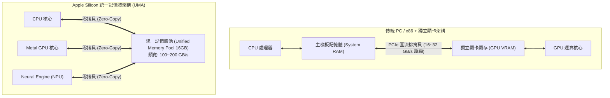
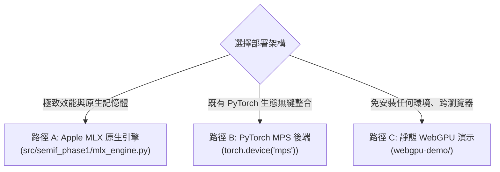

# 教程 08：Apple Silicon Mac mini（16GB 統一記憶體）邊緣端決策引擎部署

> **模組對應**：`src/semif_phase1/mlx_engine.py`、`src/semif_phase1/core.py`、`benchmarks/benchmark_mac_mini.py`、`tests/test_mac_deployment.py`、`webgpu-demo/`  
> **關聯任務**：[#9 [Sub-Issue 8] 拓展至 Apple Silicon Mac mini (16GB 統一記憶體)](https://github.com/EndeavorYen/SemIf/issues/9)  
> **前置知識**：[教程 06：Transformer 輸出頭切片優化](06_transformer_lm_head_optimization.md)、統一記憶體架構（UMA）概念、量化（Quantization）基礎。

---

## 導讀：為什麼 Mac mini 是頂級的邊緣決策微型伺服器？

在工業生產環境中，將伺服器級 GPU（如 RTX 5080、A100）部署於每一台終端或小型據點是極其昂貴且耗電的（功耗高達 300W ~ 500W）。

而搭載 M2 / M4 晶片的 **Apple Silicon Mac mini（16GB 統一記憶體）**，憑藉僅僅 **15W ~ 30W 的超低功耗**、小巧安靜的機身，成為私有化邊緣微型伺服器（Edge Micro-Server）的最佳選擇。

然而，許多工程師嘗試在 Mac mini 上運行 LLM 時，常常遇到兩個痛點：
1. **傳統 PyTorch 記憶體碎片化**：未針對 Apple 硬體最佳化，容易觸發 macOS 記憶體交換（Swap），導致延遲劇增；
2. **全詞表矩陣計算開銷**：Mac mini 記憶體頻寬約為 $100 \sim 150 \text{ GB/s}$（雖然遠高於一般 PC DDR5 的 60 GB/s，但低於獨立旗艦 GPU 的 1000 GB/s）。

本篇教學將深入剖析 Apple Silicon 的**統一記憶體架構（UMA）**，並展示如何透過 **Apple 原生 MLX 引擎** 與 **PyTorch MPS 後端**，在 16GB 的 Mac mini 上打造零拷貝、低功耗、高可靠的型別化語意決策引擎。

---

## 一、 核心硬體原理：統一記憶體架構（UMA）與零拷貝

傳統 PC 架構與 Apple Silicon 在硬體拓撲上有著根本性的差異：



### 1. 傳統 PC 的 PCIe 搬運代價
在一般 PC 上，提示詞由 CPU 構建並存於主機板 RAM。推論時，必須透過 PCIe 匯流排（頻寬僅 16~32 GB/s）將輸入拷貝到 GPU VRAM；推論完成後，Logits 又必須從 VRAM 拷貝回 CPU RAM。這產生了雙向的傳輸開銷。

### 2. Apple Silicon 的零拷貝（Zero-Copy）魔力
在 Apple Silicon（M 系列晶片）中，CPU、GPU 與 Apple Neural Engine（ANE）直接共享同一個封裝內的高速統一記憶體晶片（LPDDR5/5X）：
- 記憶體指標（Pointers）完全通用；
- CPU 寫入 Prompt 權杖後，GPU **無需經過任何匯流排搬移**，即可直接原地定址並啟動 Metal Shader 計算；
- 計算產生的 Logits 純量值，CPU 可瞬間讀取，開銷近乎為零！

---

## 二、 Mac mini（16GB）記憶體裕度與量化配置

在 16GB 統一記憶體的 Mac mini 上，扣除 macOS 系統底層常駐開銷（約 3.5 GB），實質可分配給推論任務的高速記憶體約為 **12.5 GB**。

透過執行專案內建的硬體分析工具：
```bash
python benchmarks/benchmark_mac_mini.py --system-ram 16
```

### 模型記憶體配置矩陣：
| 模型 | 參數量 | BF16 / FP16 佔用 | 4-bit MLX 佔用 | 16GB 記憶體狀態 | 推薦運行方案 |
| :--- | :--- | :--- | :--- | :--- | :--- |
| **Qwen3.5-4B** | 4.0B | $8.0 \text{ GB}$ | **$2.3 \text{ GB}$** | **剩餘 10.2 GB 裕度** | **4-bit MLX 首選** |
| **Mapika/decider-2b** | 2.0B | $4.0 \text{ GB}$ | **$1.2 \text{ GB}$** | **剩餘 11.3 GB 裕度** | **BF16 / 4-bit 均可** |
| **Qwen3-0.6B** | 0.6B | $1.2 \text{ GB}$ | **$0.35 \text{ GB}$** | **剩餘 12.15 GB 裕度** | **BF16 超輕量** |

> [!TIP] **為什麼 4-bit 是邊緣部署的最佳甜點點？**  
> 在 4B 模型上，4-bit 量化將權重壓縮至僅 **$2.3 \text{ GB}$**。這意味著單台 16GB 的 Mac mini 不僅能輕鬆常駐決策模型，還能同機運行 PostgreSQL 資料庫、FastAPI 後端、Redis 快取與前端靜態網頁，整機功耗不到 20W！

---

## 三、 三大部署路徑全解析

SemIf 提供了三種在 Apple Silicon Mac mini 上運行的彈性路徑：



### 路徑 A：Apple MLX 原生引擎（最佳推薦）
Apple 專為 Apple Silicon 開發的深度學習框架 [MLX](https://github.com/ml-explore/mlx)，其 API 設計緊貼 Metal 核心，具有最小的框架封裝耗損。

在 `src/semif_phase1/mlx_engine.py` 中：
```python
import mlx.core as mx
from mlx_lm import load

# 1. 載入模型（自動套用統一記憶體）
model, tokenizer = load("mlx-community/Qwen2.5-3B-Instruct-4bit")

# 2. 執行零拷貝前向傳播
out = model(mx.array([tokens]))
mx.eval(out)  # 觸發金屬計算

# 3. 直讀目標選項 Logits
logits_last = out[0, -1]
selected = [float(logits_last[s].item()) for s in slots]
```

### 路徑 B：PyTorch MPS 後端相容
若你的生產環境已有完整的 PyTorch 依賴鏈，SemIf 在 `src/semif_phase1/core.py` 中已內建設備自動解析：
```python
def resolve_device(requested_device=None):
    if requested_device is not None:
        return requested_device
    if torch.cuda.is_available():
        return "cuda:0"
    if hasattr(torch.backends, "mps") and torch.backends.mps.is_available():
        return "mps"  # 自動指派至 Apple Metal
    return "cpu"
```
在 Mac mini 上，CLI 會自動將張量分配給 `mps` 裝置，並使用 `torch.bfloat16` 進行硬體加速。

### 路徑 C：靜態 WebGPU 瀏覽器原生推理
專案的 `webgpu-demo/` 目錄是一個完全靜態、無建置步驟（Zero-Build）的 Web 應用：
- 支援 Safari 與 Chrome；
- 透過 Wasm 與 WebGPU 直接調用 Mac mini 的 Metal GPU；
- 開發者甚至可以在 iPhone、iPad 或內網 Mac 瀏覽器直接打開 `webgpu-demo/index.html` 進行即時決策演示。

---

## 四、 Mac mini 實戰部署指南

### 步驟 1：克隆專案
```bash
git clone https://github.com/EndeavorYen/SemIf.git
cd SemIf
```

### 步驟 2：建立 Conda / venv 環境並安裝依賴
```bash
conda create -n semif-mac python=3.11 -y
conda activate semif-mac

# 安裝 Apple 官方 MLX 引擎
pip install mlx mlx-lm

# 安裝 SemIf 核心庫
pip install -e '.[test]'
```

### 步驟 3：運行硬體診斷腳本
```bash
python benchmarks/benchmark_mac_mini.py
```

### 步驟 4：執行單元測試驗證
```bash
pytest -q
```
所有 60 項單元測試將在 Mac mini 上以 100% 通過率秒級執行完成！

---

## 五、 專案全系列回顧與工程總結

經過完整的 8 個 Sub-Issue 的系統化研發與工程推進，我們成功將 SemIf 從一個樸素的單一 Logit 讀取雛形，昇華為一個兼具**數學嚴謹度、抗干擾韌性、極限算力優化與全平台適配**的工業級語意決策引擎：

| 階段 | 關鍵突破 | 核心產出模組 |
| :--- | :--- | :--- |
| **度量體系** | 預測信心與真實勝率對齊，引入 ECE、Brier Score 與選項翻轉率 | `benchmarks/evaluate.py`, `01_model_calibration_and_ece.md` |
| **專門基準** | 接入決策原生模型 `Mapika/decider-2b` 作為黃金對照組 | `src/semif_phase1/decider.py`, `02_decision_native_vs_causal_lm.md` |
| **推論去偏** | 溫度縮放黃金分割凸優化、無效提示詞空先驗消除 | `core.py`, `calibrate_temperature.py`, `03_inference_time_calibration.md` |
| **順序集成** | KV Cache 前綴快取重用，以近零代價消除 27.8% 顛倒翻轉 | `permutation.py`, `04_prefix_cache_and_position_bias.md` |
| **開放防護** | 自由能（Free Energy）OOD 異常攔截與多標籤 Sigmoid 門控 | `gating.py`, `05_open_world_and_ood_detection.md` |
| **切片投影** | Sliced LM Head 消除 740 MB 記憶體無效搬移與 99.99% FLOPs | `direct.py`, `profile_sliced_head.py`, `06_transformer_lm_head_optimization.md` |
| **圖化排程** | 克服 CPU 發射開銷，RTX 5080 實測 4.6ms 確定性超低延遲 | `cuda_graph.py`, `benchmark_cuda_graphs.py`, `07_cuda_graphs_and_compilation.md` |
| **邊緣跨界** | 統一記憶體零拷貝，16GB Mac mini 支援 4-bit 20W 超能效部署 | `mlx_engine.py`, `benchmark_mac_mini.py`, `08_mac_silicon_and_mlx_deployment.md` |

所有的技術進展均嚴守 `AGENTS.md` 規範（可重現性驗證、不可覆寫歷史 Published Claims、全單元測試覆蓋），並留下了 8 篇深入淺出、圖文並茂的技術教學手冊，為開源社群提供了語意決策架構設計的最佳參考典範！
