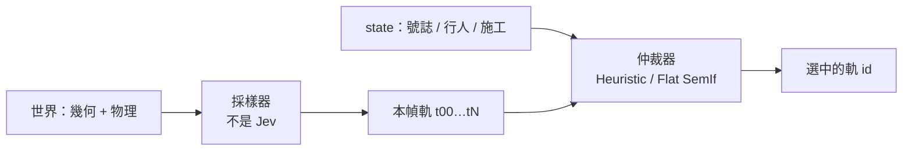

# 教程 09：動態候選空間與語意仲裁（Sampler vs Arbiter）

> **模組對應**：`src/semif_phase1/trajectory_sampler.py`、`src/semif_phase1/action_tree.py`、`benchmarks/benchmark_jevpilot_hierarchical.py`、`demo/server.py`  
> **關聯任務**：[ #71 共用動態幾何採樣](https://github.com/EndeavorYen/SemIf/issues/71)、[ #72 動態分桶樹](https://github.com/EndeavorYen/SemIf/issues/72)、[ #73 Jev 動態候選](https://github.com/EndeavorYen/SemIf/issues/73)  
> **前置知識**：[教程 03：推論期校準](03_inference_time_calibration.md)、[教程 05：OOD 偵測](05_open_world_and_ood_detection.md)

---

## 導讀：為什麼每幀都丟 `["左轉","右轉","前進"]` 不需要 Jev？

如果決策空間永遠是靜態 enum，行為樹、PID、甚至幾行 if 就能在微秒內解完。把神經網絡拿來選固定按鈕，是查表，還比較慢。

Jev／SemIf 的價值是：**對「這一幀才存在的候選」做語意仲裁。** 候選由幾何採樣器當場生出來；紅燈、行人、施工出現在 state 裡，不寫進採樣器。

錯誤用法：

```json
{ "choices": ["STEER_LEFT", "STEER_RIGHT", "GO_STRAIGHT", "BRAKE"] }
```

正確用法：採樣器先給出本幀物理上站得住的軌，再附語意描述交給仲裁器。

---

## 一、兩層，不要混



| 層 | 准做 | 不准做 |
| :--- | :--- | :--- |
| 採樣器 | 轉向×速度網格、短時程 rollout、碰撞、出界、線前是否把速度收到接近 0 | 因為紅燈才生煞車軌 |
| 仲裁器 | 讀 state 的語意 + 軌的幾何描述，選一條本幀軌 | 發明採樣器沒給的 action |

三家方法必須看到**同一批** `obs["candidates"]`（同一顆種子、同一時刻）。差在怎麼打分。

---

## 二、幾何採樣在做什麼

`sample_trajectories` 不接收 `signal`。停止線只是公尺座標 `stop_line_z`。

1. 在轉向 `{-0.28,…,0.28}` 與速度偏移 `{+2.5, 0, -4}` 上取網格，加上種子 jitter。
2. 用與閉環相同的點質量動力學 rollout 約 0.6s。
3. 標幾何：`end_speed`、`end_x`、`collision`、`offroad`、`stop_at_line`（**線前速度 &lt; 0.8 且尚未越過線**）。
4. 濾掉明顯出界的高速樣條。輸出 id `t00`、`t01`、… 數量可變，至少 2 條。

兩份 world 只差紅燈／綠燈時，軌的幾何標籤必須相同。號誌只活在 `obs["intersection"]["signal"]`。

---

## 三、動態分層（不是全球 enum）

舊樹把 halt 葉子寫死成 `v2`、`v5`。那是另一張靜態菜單。

現在 `build_drive_tree(candidates, candidate_meta)` **對本幀軌分桶**：

- **halt**：端速低，或幾何上停在線前
- **lateral**：`|steer| ≥ 0.12`
- **lane**：其餘

JevPilot 執行路徑只留 Heuristic 與 Flat SemIf，對全部本幀軌做一次選擇。Hierarchical 刪軌的實驗與 GPU 數字見 [教程 10](10_jev_vs_classifier_io.md) 與 [#80](https://github.com/EndeavorYen/SemIf/issues/80)。

感測器是否 NaN 是 parser，不是樹的一刀。`anomaly: null` 不算 OOD。

---

## 四、怎麼量化「開得好」

不要用會被誤報灌水的綜合分當 headline。閉環主指標是 **clean completion**：任務完成，且沒有碰撞、出界、闖紅燈、行人傷亡。OOD 拆成 recall（真的壞感測器時有沒有停）與 false-positive（好感測器時不准亮 fail_safe）。

```bash
python benchmarks/benchmark_jevpilot_hierarchical.py --mock --episodes 1 --seed 42 --raw-mode \
  --output /tmp/jevpilot-sampler-mock.json
```

真實 GPU 必須 `--device cuda`、新輸出路徑、報告裡 `device: cuda` 且沒有 `MockDecisionEngine`。

---

## 五、對照本專案檔案

| 角色 | 檔案 |
| :--- | :--- |
| 採樣器 | `src/semif_phase1/trajectory_sampler.py` |
| 分桶樹 | `src/semif_phase1/action_tree.py`、`demo/server.py` 的 `build_drive_tree` |
| 閉環世界 | `benchmarks/benchmark_jevpilot_hierarchical.py` 的 `get_observation` |
| 開得好 | `benchmarks/driving_quality.py` |

固定 `v0`–`v5` 只適合作消融，不適合作「Jev 有沒有用」的結論。
