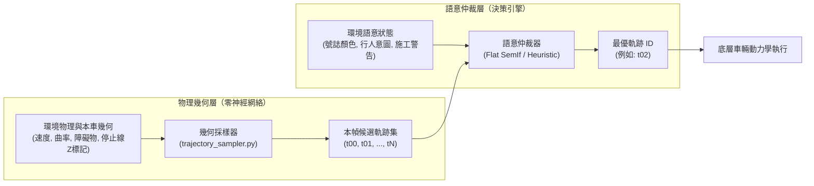

# 教程 09：動態候選空間與語意仲裁（Sampler vs Arbiter）

> **模組對應**：`src/semif_phase1/trajectory_sampler.py`、`src/semif_phase1/action_tree.py`、`benchmarks/benchmark_jevpilot_hierarchical.py`、`demo/server.py`  
> **關聯任務**：[ #71 共用動態幾何採樣](https://github.com/EndeavorYen/SemIf/issues/71)、[ #72 動態分桶樹](https://github.com/EndeavorYen/SemIf/issues/72)、[ #73 Jev 動態候選](https://github.com/EndeavorYen/SemIf/issues/73)  
> **前置知識**：[教程 02：決策原生 vs 因果 LM](02_decision_native_vs_causal_lm.md)、[教程 03：推論期校準](03_inference_time_calibration.md)、[教程 05：開放世界與 OOD 偵測](05_open_world_and_ood_detection.md)

---

## 導讀：為什麼每幀只選「左轉、右轉、直行」不是真正的智慧控制？

**靜態動作枚舉無法解決動態物理世界的連續控制問題。**

如果自動駕駛的決策空間永遠是固定的列舉常數（例如 `["STEER_LEFT", "STEER_RIGHT", "GO_STRAIGHT", "BRAKE"]`），那麼狀態機、行為樹（Behavior Tree）或幾行條件判斷（if-else）就能在微秒內完成運算。把昂貴的因果語言模型或深度神經網絡拿來點選固定按鈕，本質上只是查表，延遲更高，且對真實物理約束一無所知。

在真實物理控制中，車輛在不同車速、路面曲率與障礙物距離下，所面臨的「可行動作」每毫秒都在變動。SemIf 與 Jev 的核心價值在於：**對「當前幀才動態生成的一組幾何候選軌跡」進行高階語意仲裁（Semantic Arbitration）。**

候選軌跡由純物理幾何採樣器於當前幀動態計算生成；而紅綠燈號誌、行人橫越意圖、施工導引等高階情境資訊則封裝於環境狀態（State）中。兩者職責切分明確，互不越界。

```json
// ❌ 錯誤用法：退化成靜態枚舉查表
{ "choices": ["STEER_LEFT", "STEER_RIGHT", "GO_STRAIGHT", "BRAKE"] }

// ✅ 正確用法：採樣器動態提供本幀物理可行的軌跡池，交由仲裁器裁決
{
  "candidates": {
    "t00": [16.0, 0.00, 0.00, 0.000, false, false],
    "t01": [12.0, -0.14, -0.42, 0.000, false, false],
    "t02": [0.0, 0.00, 0.00, 0.000, false, true]
  }
}
```

---

## 一、架構解耦：幾何採樣器 vs. 語意仲裁器

決策系統必須嚴格劃分為「物理採樣」與「語意仲裁」兩層。兩層職責分離，才能確保評測誠實與系統穩定性。



### 職責劃分原則

| 維度 | 幾何採樣器（Trajectory Sampler） | 語意仲裁器（Semantic Arbiter） |
| :--- | :--- | :--- |
| **本質** | 確定性前向滾動（Kinematic Rollout）與幾何剪裁 | 多目標權衡、型別約束、Logit 分數仲裁 |
| **輸入依賴** | 本車幾何位姿、當前車速、道路曲率、幾何障礙物坐標 | 採樣器候選清單 + State 語意（號誌、行人、施工等） |
| **准許行為** | 生成轉向與速度網格、短時程碰撞驗證、出界率計算、標註「停止線前幾何收速」標籤 | 解讀交通法規與環境語意，對所有候選進行直接評分排序，選出一條最優軌跡 ID |
| **嚴格禁止** | **禁止讀取交通號誌語意**（絕對不可因為紅燈而特意捏造煞車軌跡） | **禁止捏造未在採樣器清單中的動作**（必須嚴格遵從 Schema 約束） |

---

## 二、評測誠實性（Evaluation Honesty）

在基準測試（Benchmarking）中，保持比較基準的公平性是唯一的科學原則。

1. **同源候選（Same Candidate Set）**：
   - 無論評測的是傳統規則基線（Heuristic）、單步扁平模型（Flat SemIf）或是歷史實驗模式，在同一時間步、相同亂數種子下，**所有受測模型必須看見完全相同的一批 `obs["candidates"]`**。
   - 性能差異只能來自各仲裁器對狀態與候選的「理解與評分能力」，絕不能來自採樣器偏心。

2. **禁止特製軌跡作弊**：
   - 幾何採樣器對號誌是「色盲」的。停止線在採樣器眼裡只是一個距離座標（`stop_line_z`，單位為公尺）。
   - 採樣器**每一幀都必須保留幾何慢速與停車軌跡**供所有模型挑選。
   - 嚴格禁止「看到紅燈就單獨注入停止軌跡」或「在 Heuristic 模式下拔除煞車選項」等劣化基準的不正當行為。

3. **統一開得好（Driving Quality）指標**：
   - 評估自動駕駛表現，絕不能採用易被誤報灌水的模糊綜合分。
   - 本專案首要指標為 **乾淨完成率（Clean Completion Rate）**：成功完成情境任務，且全程為 **0 次事故**（0 碰撞、0 衝出車道、0 闖紅燈、0 行人碰撞）。

---

## 三、幾何採樣器的工程實作

幾何採樣器位於 [`src/semif_phase1/trajectory_sampler.py`](file:///D:/Code/SemIf/src/semif_phase1/trajectory_sampler.py)。它採用確定性網格加上以種子控制的微小抖動（Jitter）。

### 1. 2D 點質量動力學前向滾動（Rollout）

採樣器以前向模擬驗證軌跡可行性：
- 滾動步數：$\text{ROLLOUT\_STEPS} = 40$ 步
- 步長：$\Delta t = 0.05\text{ s}$（合計前瞻預測時程 $2.0\text{ s}$）

車輛狀態更新公式如下：

$$a_t = \text{clamp}\left((v_{\text{target}} - v_t) \times 4.0, -12.0, 6.0\right)$$

$$v_{t+1} = \max(0.0, v_t + a_t \Delta t)$$

$$\delta_{t+1} = \delta_t + (\delta_{\text{target}} - \delta_t) \times 6.0 \Delta t$$

$$z_{t+1} = z_t + v_{t+1} \Delta t$$

$$x_{t+1} = x_t + \delta_{t+1} v_{t+1} \Delta t \times 2.0 - \kappa v_{t+1} \Delta t \times 1.5$$

其中 $\kappa$ 為道路曲率，$x$ 為橫向偏位，$z$ 為縱向行進距離。

### 2. 候選軌跡生成網格

採樣政策向 3D planner 看齊（#85），仍跑在 1D 跑道上、不搬路網：
- 轉向上限 $\pm 0.85$（worker 的 clamp）；約 1/3 樣本掃滿範圍，其餘貼近當前舵角。
- 速度是 `planning_max` 的比例混合：停車、慢速 $0.25$–$0.55$、巡航 $0.78$–$1.0$。**不**複製 worker 的 `O&&r<8` 紅燈速度偏置。
- 前瞻 $31\times 0.05\text{s}$（worker 的 `p/31`）。出界半寬 $4.5\text{m}$、碰撞半徑與 `step()` 相同。
- 最多 16 條（letter-slot）。

### 3. 六維候選向量架構（Candidate Vector Schema）

每條合格的候選軌跡被編碼為六維向量，兼具緊湊度與語意表達力：

```python
# [speed, steer, route_error, offroad, collision, stop_at_line]
# 例如：[16.2, -0.14, 0.35, 0.000, False, False]
```

- `speed`（$v_{\text{target}}$）：目標行駛速度（$\text{m/s}$）。
- `steer`（$\delta_{\text{target}}$）：目標轉向舵角弧度。
- `route_error`（$x_{\text{end}}$）：預測滾動結束時與車道中心的橫向偏移量（$\text{m}$）。
- `offroad`：前向滾動過程中超出路面邊界（$|x| > 4.0\text{ m}$）的步數佔比。
- `collision`：是否在時程內與幾何障礙物發生邊界碰撞。
- `stop_at_line`：**幾何停車條件**。定義為車輛在尚未越過停止線前，速度平順收至 $0.8\text{ m/s}$ 以下（$v < 0.8 \text{ 且 } z < z_{\text{stop}} - 0.3$）。這純粹是運動學計算，不代表號誌判斷。

---

## 四、動態分桶樹（Dynamic Bucketing）

在歷史版本中，決策樹將葉子節點寫死為靜態的符號標籤（如固定動作 $v_0 \sim v_5$）。這種做法切斷了軌跡與當前物理環境的即時關聯。

現代設計在 [`src/semif_phase1/action_tree.py`](file:///D:/Code/SemIf/src/semif_phase1/action_tree.py) 中改用 `partition_ids` 進行**當前幀動態分桶**：

```mermaid
flowchart TD
    AllCands["本幀候選集<br/>(t00...t15)"] --> Part{"動態幾何分桶<br/>partition_ids"}
    Part -->|end_speed < 1.2 或 stop_at_line| Halt["halt 桶<br/>(減速與停車軌跡)"]
    Part -->||steer| >= 0.12| Lat["lateral 桶<br/>(側向變換與避障軌跡)"]
    Part -->|其餘軌跡| Lane["lane 桶<br/>(車道保持平順行駛)"]
```

```python
def partition_ids(
    candidates: Dict[str, List[Any]], 
    meta: Optional[Dict[str, Any]] = None
) -> Tuple[List[str], List[str], List[str]]:
    halt, lateral, lane = [], [], []
    for cid, vec in candidates.items():
        end_speed = meta[cid]["end_speed"] if meta else vec[0]
        steer = meta[cid]["steer"] if meta else vec[1]
        stop_line = meta[cid]["stop_at_line"] if meta else vec[5]
        
        if end_speed < 1.2 or stop_line:
            halt.append(cid)
        elif abs(steer) >= 0.12:
            lateral.append(cid)
        else:
            lane.append(cid)
    return halt, lateral, lane
```

### 關鍵設計結論：樹只供解釋，不作剪枝

在 JevPilot 執行路徑中，我們嚴格遵守：
1. **Flat SemIf 一步仲裁**：神經模型直接在所有有效候選軌跡（$t_{00} \sim t_N$）中打分選擇。
2. **決策樹只作後驗解釋（Explainability）**：分桶樹僅用於生成結構化解釋路徑（Rationale），絕不提前把候選軌跡丟掉。
3. **感測器異常防護**：感測器是否包含 `NaN`、`Infinity` 或空值，是由最前端的解析器（Parser）把關，而非樹中的普通語意節點。未發生異常時 `anomaly: null`，不得誤觸 OOD 報警。

---

## 五、指標定義：Clean Completion vs. SDI

過去的語意駕駛指標（SDI）容易因不同情境的權重設定或誤報產生偏差。本專案以 [`benchmarks/driving_quality.py`](file:///D:/Code/SemIf/benchmarks/driving_quality.py) 的客觀指標作為衡量核心：

1. **乾淨完成（Clean Completion）**：
   - 判定標準：任務達成且未發生任何違規或意外事故。
   - 即：`completed == True` 且 `collision == False` 且 `off_track == False` 且 `red_light_violation == False` 且 `pedestrian_casualty == False`。

2. **OOD 召回率（OOD Recall）**：
   - 僅在環境確實注入感測器異常（`true_ood == True`）時，系統能正確觸發 `fail_safe` 並平順煞停且無事故的比率。

3. **OOD 誤報率（OOD False Positive Rate）**：
   - 在正常感測環境下，系統誤報 `fail_safe` 的比率。在乾淨行駛評測中，**誤報率必須為 0**。

---

## 六、專案實作對照與快速驗證

### 核心模組對照

| 功能職責 | 核心檔案與位置 |
| :--- | :--- |
| **動態幾何採樣** | [`src/semif_phase1/trajectory_sampler.py`](file:///D:/Code/SemIf/src/semif_phase1/trajectory_sampler.py) |
| **動態分桶與決策樹** | [`src/semif_phase1/action_tree.py`](file:///D:/Code/SemIf/src/semif_phase1/action_tree.py) |
| **即時決策伺服器** | [`demo/server.py`](file:///D:/Code/SemIf/demo/server.py) (`DecisionEngine.classify_jev`) |
| **閉環評測與模擬** | [`benchmarks/benchmark_jevpilot_hierarchical.py`](file:///D:/Code/SemIf/benchmarks/benchmark_jevpilot_hierarchical.py) |
| **駕駛品質指標計算** | [`benchmarks/driving_quality.py`](file:///D:/Code/SemIf/benchmarks/driving_quality.py) |

### 快速驗證指令

在本地進行無 GPU 依賴的 Mock 快速驗證：

```bash
python benchmarks/benchmark_jevpilot_hierarchical.py \
  --mock \
  --episodes 1 \
  --seed 42 \
  --raw-mode \
  --output /tmp/jevpilot-sampler-mock.json
```

若要提交正式的真實模型驅動結果，必須在具備 CUDA 的伺服器上執行：

```bash
python benchmarks/benchmark_jevpilot_hierarchical.py \
  --device cuda \
  --episodes 10 \
  --seed 42 \
  --raw-mode \
  --output results/phase5-jevpilot-2.0-dq-rtx5080-new.json
```

> **注意**：依據評測誠實性規範，正式成果報告內必須明確標記 `device: cuda`，且不得包含 `MockDecisionEngine`。

---

## 七、網頁與閉環怎麼對齊

見 [#83](https://github.com/EndeavorYen/SemIf/issues/83)。

- **契約聽測試**：號誌不進採樣器；六欄向量；`VECTOR_INSTRUCTIONS`（`Choose a safe driving path.`）不含 stop coaching；仲裁器同一份 `classify_jev`。
- **採樣品質聽 3D planner**：路網與車體以網頁為準，不要把 Demo 改成 Python 粗網格。
- **分數聽 Python 閉環**：3D 世界不同，GPU 乾淨完成率不是網頁成績。
