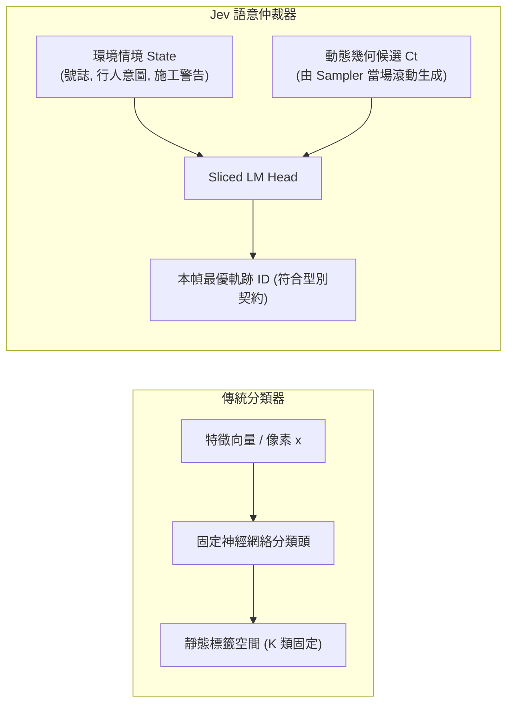
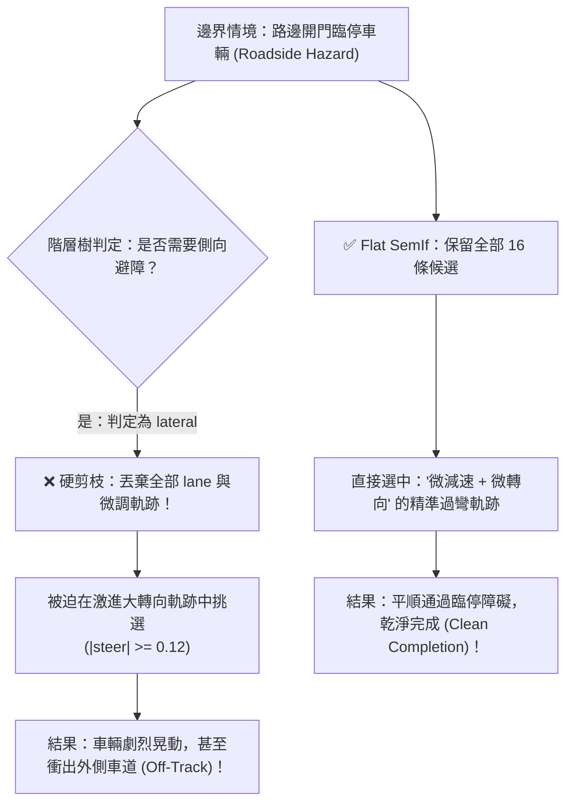

# 教程 10：Jev 與傳統分類器——輸入／輸出維度，以及為何 JevPilot 拿掉 Hierarchical

> **模組對應**：`src/semif_phase1/trajectory_sampler.py`、`src/semif_phase1/action_tree.py`、`demo/server.py`、`benchmarks/driving_quality.py`  
> **關聯任務**：[ #80 移除 JevPilot Hierarchical](https://github.com/EndeavorYen/SemIf/issues/80)、[ #79 樹只解釋不刪軌](https://github.com/EndeavorYen/SemIf/issues/79)、[ #71 動態採樣](https://github.com/EndeavorYen/SemIf/issues/71)  
> **前置知識**：[教程 02：決策原生 vs 因果 LM](02_decision_native_vs_causal_lm.md)、[教程 06：LM Head 投影優化](06_transformer_lm_head_optimization.md)、[教程 09：動態候選與語意仲裁](09_dynamic_candidates_and_arbitration.md)

---

## 導讀：分類器的本質邊界在哪裡？

**傳統分類器在靜態標籤中找答案，Jev 在動態物理候選中做仲裁。**

傳統分類器問的問題是：
> 「在一個**固定、事先列好的標籤集合** $\mathcal{Y} = \{c_1, c_2, \dots, c_K\}$ 中，這筆輸入最可能屬於哪一類？」

而 Jev / SemIf 問的問題則是：
> 「在**當前物理時間步才動態生成的一組候選軌跡** $\mathcal{C}_t = \{t_{00}, t_{01}, \dots, t_{N-1}\}$ 中，哪一條最符合高階環境語意，且輸出必須完全遵守型別契約？」

兩者在底層實現上都可以採用單步驟的 Letter-slot 投影與 Argmax 讀出，但兩者的根本分歧在於：
1. **輸入與輸出的維度從何而來？**
2. **系統約束的是「型別契約（Schema）」還是「語意可能性（Semantic Possibility）」？**

在 JevPilot 系統的早期探索中，我們曾實作過「階層式決策樹（Hierarchical Tree）」，試圖先將候選軌跡粗分為 halt / lateral / lane 等粗分類別再行打分。然而真實 GPU 閉環實測證實：**Hierarchical 剪枝會不可逆地抹殺細膩的安全軌跡，在控制表現上顯著輸給 Flat SemIf。**

因此，JevPilot 正式執行路徑已全面退役 Hierarchical 剪枝。本教程將深入剖析兩者的輸入／輸出維度本質，並揭示階層式剪枝在物理控制中失敗的工程原因。

---

## 一、輸入維度（Input Dimension）：靜態特徵 vs. 具身情境



### 三種範式的維度對比

| 比較維度 | 傳統分類器 | 自由生成式因果 LM | Jev / SemIf 仲裁器 |
| :--- | :--- | :--- | :--- |
| **標籤空間 $\mathcal{Y}$** | 訓練時固定不可變（如 1000 類 ImageNet） | 開放字彙表（32k ~ 150k Token） | **時變動態空間**（當前幀採樣出的 $K$ 條軌跡） |
| **輸入資料結構** | 密集數值矩陣 $\mathbb{R}^d$ 或影像張量 | 無結構的自由長文本 Prompt | **結構化 State** ＋ **當前幀動態 Candidates 向量** |
| **感知處理邏輯** | 像素端到端直通分類頭 | 文本化長描述直接輸入 | 視覺先提煉為可供性（Affordances）與幾何特徵，再交由 Jev 裁決 |
| **即時適應性** | 無法處理推理期新出現的幾何約束 | 自回歸生成可能幻覺捏造不存在的動作 | 自然融入採樣器根據即時車速與道路形狀計算的候選 |

在 JevPilot 中，輸入 State 包含車速（`speed_mps`）、路口號誌（`signal`）、行人相對位置與施工標記；同時注入當前幀由採樣器生成的 `candidates` 字典。號誌活在 State 裡，採樣器只關注幾何可行性。

---

## 二、輸出維度（Output Dimension）與型別約束

在物理控制流中，約束輸出的方式決定了系統的生與死：

```text
❌ 1. 完全不約束（自由文字輸出）
   模型輸出："I think the car should gently steer left by 2 degrees..."
   致命缺點：自回歸解碼延遲高（數百毫秒）、文字解析可能失敗（Parse Error）、無法進行物理極限 Clamp。

❌ 2. 低級過度約束（全域靜態枚舉）
   動作空間：["TURN_LEFT", "TURN_RIGHT", "GO_STRAIGHT", "BRAKE"]
   致命缺點：退化為查表，失去了車速、曲率與時間的連續性，需要額外手寫大量繁複的 PID 或狀態機。

✅ 3. 高級型別約束（動態候選型別契約）
   約束輸出：嚴格限制輸出為 JSON 鍵值，且 Trajectory ID 必須嚴格落在本幀候選集合中：
   { "choice": "t03" }  // 其中 t03 必須 ∈ 本幀 candidates
```

### Letter-Slot 的「黃金甜區（Sweet Spot）」

當動態候選數量 $K$ 落在 **8 到 16 條軌跡** 時，單 Token 讀出的 Sliced LM Head 處於效能與表達力的黃金平衡點：
- **極致低延遲**：單次前向傳播即可讀出所有候選 Logit，無需自回歸多步解碼。
- **足夠表達力**：8～16 條幾何軌跡已足以覆蓋維持車道、溫和減速、緊急煞停、輕度避障與強烈閃避等全部物理可能性。

如果在 8～16 條候選之上，再強行套上一層粗分類決策樹，是在**輸出維度上進行二次有損壓縮**。被壓縮掉的不是雜訊，而是處理邊界情況的微調可能性！

---

## 三、深度剖析：為何 Hierarchical 決策樹在 JevPilot 中宣告退役？

### 1. 直覺陷阱： coarse-to-fine 真的更好嗎？

在軟體工程中，分層分類（Hierarchical Classification）是常見的模式：
> 「先決定是大方向是停車（halt）、側向避障（lateral）還是維持車道（lane），再在選定分支挑選具體軌跡，豈不是能降低模型負擔？」

然而，在自動駕駛閉環中，這種做法存在致命盲點：**幾何採樣器已經保證了候選池中每一條軌跡的物理可行性。仲裁器的核心職責是權衡邊界情境，而粗分類的「硬剪枝（Hard Pruning）」會引發不可逆的級聯失誤。**



### 2. 經典失敗案例：路邊臨停開門車輛（Roadside Hazard）

在 `roadside_parked_hazard` 測試中，路邊停靠車輛開門侵入主車道約 0.3 公尺：
- **最優駕駛行為**：車輛應採取「微減速、微向左平移 0.4 公尺」的複合軌跡。
- **Hierarchical 剪枝的悲劇**：
  1. 決策樹在 `around` 節點判定情境需要繞行，進入 `lateral` 分支。
  2. 動態分桶將候選池**硬剪枝**，只保留轉向角 $|\text{steer}| \ge 0.12$ 的大角度轉向軌跡，將微調軌跡直接丟棄。
  3. 神經模型只能在激烈大轉向中選擇，導致車輛劇烈向左猛拐，隨後因轉向過度而衝出對向車道（Off-track 事故）。
- **Flat SemIf 的表現**：模型同時俯瞰所有候選，直接挑中綜合懲罰最小、轉向適中的微調軌跡，平穩通過。

### 3. 真實 GPU 基準實測數據（RTX 5080, Qwen2.5-3B, seed 42, raw_mode）

以下為真實 CUDA 環境下的完整實測對照記錄：

| 實驗架構與評測檔案 | 乾淨完成率 (Clean Completion) | 路邊臨停避讓 (Roadside Hazard) | P50 推論延遲 | 決策模式性質 |
| :--- | :---: | :---: | :---: | :--- |
| **Hierarchical 刪軌樹**<br/>`phase5-jevpilot-2.0-dq-rtx5080-dynsample.json` | **75%** | **0 / 2**（全軍覆沒） | ~420 ms | 粗樹硬剪枝候選集 |
| **Flat SemIf（單步扁平仲裁）**<br/>`phase5-jevpilot-2.0-dq-rtx5080-dynsample.json` | **85%** | **2 / 2**（完美通過） | **~95 ms** | 全域候選一步打分 |
| **Hierarchical 解釋樹（不刪軌）**<br/>`phase5-jevpilot-2.0-dq-rtx5080-explain-tree.json` | **85%** | **2 / 2**（完美通過） | ~457 ms | 樹僅生成文字解釋，實際仍按 Flat 打分 |

#### 關鍵實證結論：
1. **剪枝樹輸在語意空間被閹割**：硬剪枝降低了 10% 的乾淨完成率，在需要精細控制的臨停避讓情境直接掛零。
2. **只作解釋的樹對控制質量零提升，徒增 4 倍延遲**：若樹不刪軌、只在事後記錄路徑，其駕駛品質與 Flat 完全相同（85% vs 85%），但推論延遲由 95ms 暴增至 457ms，喪失了即時控制的意義。

**因此，JevPilot 正式執行路徑全面移除 Hierarchical 決策樹，僅保留 Flat SemIf 與 Heuristic 作為即時執行器。**

---

## 四、JevPilot 2.0 的 Typed Action 落地架構

在當前版本的 JevPilot 中，動作的落地執行嚴格遵循單一軌跡契約：

```python
# 伺服器端 classify_jev 的標準返回結構
{
  "answers": {
    "vector": {
      "choice": "t03",  # 本幀選中的最優軌跡 ID
      "probabilities": { "t00": 0.05, "t01": 0.08, "t03": 0.72, ... }
    }
  },
  "meta": {
    "tree_prunes": False,  # 永遠保證不刪除採樣器候選
    "tier1_maneuver": "FLAT_SEMIF"
  }
}
```

- **軌跡向量六欄位**：`[speed, steer, route_error, offroad, collision, stop_at_line]`。
- **幾何停車標籤**：`stop_at_line` 是幾何收速特徵（速度 $< 0.8\text{ m/s}$ 且在線前），不是紅燈決策按鈕。
- **致動器解耦**：底層車輛致動器直接執行選中軌跡的目標車速與目標舵角；高階文字意圖（如 `motion: drive|stop`）僅供遙測監控，不直接接入控制迴路。
- **向後相容防護**：若客戶端請求中仍然帶有 `mode="semif_hierarchical"`，[`demo/server.py`](file:///D:/Code/SemIf/demo/server.py) 內部一律自動重導向至 Flat 執行，徹底杜絕剪枝退化。

---

## 五、全景對照：架構特性心智模型

| 特性 | 傳統分類器 | 自由生成式因果 LM | 階層式剪枝樹 (已退役) | Flat SemIf (現行標準) |
| :--- | :--- | :--- | :--- | :--- |
| **候選空間規模 $K$** | 固定靜態 $K$ | 開放辭典 (~100k) | 階層逐層縮減 ($K \to K'$) | **動態生成 ($K \in [8, 16]$)** |
| **推論延遲** | 極低 ($< 5\text{ ms}$) | 極高 ($> 300\text{ ms}$) | 中高 (~400 ms，多次轉向) | **極低且確定 ($< 100\text{ ms}$)** |
| **物理可行性保證** | 無（依賴外部映射） | 無（容易產生幻覺數值） | 容易誤剪關鍵精細軌跡 | **高（採樣器前置物理滾動）** |
| **邊界情境泛化** | 差（無法應對未見分佈） | 不可控 | 差（級聯錯誤不可挽回） | **優（全候選綜合語意權衡）** |
| **型別安全** | 僅數值索引 | 脆弱（易 Parse Error） | 複雜型別鏈 | **完全符合 Typed Schema** |

---

## 六、工程總結與核心準則

> **核心準則：約束輸出契約（Schema），解放候選語意（Candidates）。**

1. **切勿用粗糙的離散樹去裁剪物理世界的可能性**：物理採樣器產生的 8～16 條軌跡已經高度緊湊。信任模型的注意力機制去全域評分，而不是自作聰明地替模型剪枝。
2. **評測誠實高於一切**：所有受測架構必須看到相同的動態候選池。科學結論必須來自 `--device cuda` 的真實 GPU 運行數據，Mock 代碼不是物理證據。
