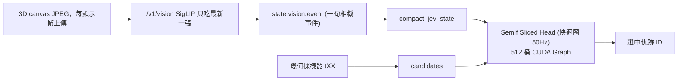

# 教程 12：JevPilot 視覺輸入

> **模組**：`src/semif_phase1/vision.py`、`demo/server.py`（`POST /v1/vision`）、`demo/jevpilot/semif-layer.js`、`benchmarks/benchmark_jevpilot_vision.py`  
> **Issue**：[ #90](https://github.com/EndeavorYen/SemIf/issues/90) [ #48](https://github.com/EndeavorYen/SemIf/issues/48) 傘 [#89](https://github.com/EndeavorYen/SemIf/issues/89)

視覺認路況，Jev 選本幀軌 `tXX`。不准自由文字轉角。不准因視覺標籤在採樣器裡塞停車軌。

---

## 驗收怎麼開

```bash
python demo/server.py --model Qwen/Qwen2.5-3B-Instruct --device cuda --port 8000
```

`http://localhost:8000/jevpilot/?seed=42` → 左下 `VISION · … · sig …`。關視覺：`?vision=0`。

```bash
# 測試（不下載 CLIP）
pytest -q tests/test_vision.py

# 閉環 A/B：遙測 vs 合成視覺（mock，不是官方分數）
python benchmarks/benchmark_jevpilot_vision.py --mock --episodes 1 --seed 42 \
  --output results/phase5-jevpilot-vision-mock.json

# 官方 CUDA：現有網頁城市，seed 42，視覺開與 ?vision=0 各一趟
python benchmarks/benchmark_jevpilot_vision.py --seed 42 --lap-timeout-s 180
```

第一次真實視覺會下載 **SigLIP** `google/siglip-base-patch16-224`（#48）。車載 JPEG 跟顯示幀送進 `/v1/vision`。SigLIP 只推論伺服器槽裡最新的一張，完成次數可以低於顯示幀率。編碼器把那張圖提煉為 `red/pedestrian` 等短分數，注入 `state.vision` 與 HUD。快迴圈仍是純文字 Sliced Head + 512 桶 CUDA Graph。

實驗性 Patch 前綴（不作預設）：`SEMIF_VISION_PREFIX=1`。未訓練投影，會關 CUDA Graph。尚未 CUDA 閉環（詳見 [教程 13](13_semif_vision_routes_and_tradeoffs.md)）。`compact_jev_state` 不放 `backend` / `prefix_tokens`，避免撐破 512 桶。

---

## 資料流



像素不直接作為未訓練 token 注入決策迴圈。`compact_jev_state` 只留 `vision.event` 與 `signal`。事件來自**相鄰兩張圖的像素框**（變大＝靠近、橫移向中心＝切入、上一幀沒有＝出現），不讀世界座標，不把示意幀尺度寫成「TTC 2.0s」。沒有框時才退回 CLIP 分數差。1024 桶可接受。

官方 CUDA 視覺分數是 seed 42 的現有網頁城市兩趟：視覺開，以及 `?vision=0`。像素來自現有 Three.js 車載相機，決策走 `demo/server.py`。`results/phase5-jevpilot-vision-cuda.json` 只在兩趟都走到 `complete`、`device` 為 `cuda`、且不是 `MockDecisionEngine` 時寫出。乾淨完成是走到 `complete`，且紅燈、撞車、撞行人、crash 都是 0。超速另記，不翻轉乾淨。這份檔不是 JevPilot2 PIL 色塊完成率的延續。

JevPilot2 的 `vision_mode=clip` 直接拒絕，不再呼叫 `render_scenario_frame`。`vision_mode=synthetic` 只給 pytest／`--mock`。

---

## 契約

| 層 | 做 | 不做 |
| :--- | :--- | :--- |
| CLIP／SigLIP | 畫面 → 短證據 | 輸出轉角 |
| 採樣器 | 幾何軌 | 因 `vision.signal=red` 多塞停車軌 |
| SemIf | 選本幀 id | 自由文字 |

同一 seed：加不加 `state.vision`，`candidates` 的鍵必須相同。
