# 教程 13：SemIf-Vision 多模態路線分析與架構抉擇

> **模組**：`src/semif_phase1/vision.py`、`src/semif_phase1/visual_prefix.py`、`demo/server.py`、`benchmarks/benchmark_jevpilot_vision.py`  
> **關聯 Issue**：[ #48](https://github.com/EndeavorYen/SemIf/issues/48) [ #90](https://github.com/EndeavorYen/SemIf/issues/90) 傘 [#89](https://github.com/EndeavorYen/SemIf/issues/89)  
> **前置閱讀**：[教程 06：LM Head 投影優化](06_transformer_lm_head_optimization.md)、[教程 07：CUDA Graphs 極限延遲](07_cuda_graphs_and_compilation.md)、[教程 10：Jev vs 分類器與架構邊界](10_jev_vs_classifier_io.md)、[教程 12：JevPilot 視覺輸入](12_jevpilot_vision.md)

---

## 導讀：視覺如何接入物理決策流？

**SemIf-Vision 的最佳落地路線是「雙率解耦（Dual-Rate）的語意可供性提取」，而非端到端拼接未訓練的 Patch Token。**

語意可供性（Semantic Affordance）是指視覺系統從像素中提煉出環境對自車行動的物理約束指標（例如紅綠燈狀態、行人穿越置信度、前方施工障礙物距離）。

在物理閉環中，感知與決策具有根本不同的時間尺度需求：
- **感知慢迴圈（10–20 Hz）**：攝影機幀輸入至輕量編碼器（如 SigLIP），提煉出結構化可供性，寫入狀態環境變數 `state.vision`。
- **決策快迴圈（50 Hz）**：SemIf 仲裁器以極致穩定的純文字 Sliced LM Head，結合 CUDA Graph 形狀分桶，在當前動態候選軌跡中裁決本幀最優 `tXX`。

本教程基於真實 GPU 閉環數據，深度覆盤為何未訓練的 Patch 投影會引發性能退化，並對三條多模態技術路線進行全方位架構評估。

---

## 一、實測覆盤：CLIP 文字證據與未訓練 Patch 前綴的邊界

在視覺輸入的探索中，必須嚴格區分「**文字證據進 Prompt（已實測）**」與「**Patch Token 拼接進隱層（PoC 試跑）**」這兩種截然不同的機制。

### 1. 閉環實測數據（Qwen2.5-3B-Instruct，CUDA Seed 42）

在統一幾何採樣器（Same Trajectory Pool）的無偏閉環測試中，`results/phase5-jevpilot-vision-clip-cuda.json` 記錄了真實的 CUDA 閉環數據：

| 評測模式 | 視覺機制 | 乾淨完成率 (Clean Rate) | 急動度 (Jerk RMS on Clean) | 決策延遲 (P50) | 機制歸因與備註 |
| :--- | :--- | :--- | :--- | :--- | :--- |
| **Flat SemIf** | **無視覺 (純遙測)** | **75.0% (15/20)** | **108.79** | **49.76 ms** | 基準線，落在 512 CUDA Graph 桶內 |
| **Flat SemIf** | **CLIP 短證據進 Prompt** | **70.0% (14/20)** | **117.49** | **86.98 ms** | **實測：文字欄位增長撐破 512 桶，落入 1024 桶；完成率跌 5%** |
| **Flat SemIf** | **Synthetic Fixture** | **65.0% (13/20)** | **91.42** | **48.16 ms** | 假視覺標籤寫入 Prompt |
| **Flat SemIf** | **32-patch Prefix (`visual_prefix.py`)** | *尚未 CUDA 閉環* | *尚未 CUDA 閉環* | *Eager (關閉 Graph)* | 本地架構試跑（PoC），未進行閉環打分 |
| **Heuristic** | 任一配置 | 65.0% (13/20) | 75.85 | < 0.1 ms | 規則幾何基線 |

### 2. 數據與機制的真實歸因

1. **70% 完成率來自「文字證據干擾決策」而非「Patch 雜訊」**：  
   在官方跑測的 `phase5-jevpilot-vision-clip-cuda.json` 中，CLIP 讀取 PIL 示意幀並將 `signal: red`、`pedestrian: 0.88` 等數值寫入 `state.vision`。實測表明，即使是高階文字證據，在未精細校準先驗時，也會對遙測常識判斷產生非預期干擾，導致完成率自 75% 跌至 70%。
2. **延遲自 ~49 ms 升至 ~87 ms 來自「1024 桶效應」**：  
   加入 `vision.*` 欄位後，Prompt 長度增加，突破了 512-bucket 上限，落入 1024-bucket（如教程 11 所示，形狀分桶擴大導致推論耗時上升），而非 CUDA Graph 被前綴打掉。
3. **未訓練 Patch 前綴（`VisualPrefixProjector`）的機制定位**：  
   `src/semif_phase1/visual_prefix.py` 的隨機 Xavier 投影層目前僅為本地架構 PoC。理論上，將未對齊的 32 個隨機向量作為前綴插入 Transformer 注意力最前段，等同於高維雜訊注入，且動態前綴必然破壞靜態 CUDA Graph；此機制不應被當作主力方案，更不可與已測的 CLIP 文字證據混為一談。
4. **目標門檻（Target Bar）說明**：  
   目前唯一通過 75% 乾淨完成率的只有「純遙測」基線。因此，**$\ge 75\%$ 是任何視覺方案必須超越的驗收門檻，而非路線一現已達成的既有成績**。當前文字視覺為 70%，仍處於待優化超越的狀態。

---

## 二、三大多模態路線架構對比

針對視覺在 JevPilot 系統中的角色，我們系統化評估以下三種技術路線：

```mermaid
flowchart TD
    subgraph Route1["路線一：雙率語意可供性解耦（推薦）"]
        style Route1 fill:#e8f5e9,stroke:#2e7d32
        Cam1["相機 JPEG (10-20Hz)"] --> Enc1["SigLIP / 輕量 Zero-Shot"]
        Enc1 --> Struct1["結構化 state.vision<br/>(signal, red, ped_prob)"]
        Struct1 --> TextPrompt1["純文字 Prompt + Candidates"]
        TextPrompt1 --> Sliced1["Sliced LM Head (50Hz)<br/>【CUDA Graph 靜態捕獲】"]
        Sliced1 --> Choice1["本幀最優軌跡 tXX"]
    end

    subgraph Route2["路線二：原生預對齊小參 VLM"]
        style Route2 fill:#fff3e0,stroke:#e65100
        Cam2["相機 JPEG (10-15Hz)"] --> VLM2["SmolVLM-500M / Qwen2-VL-2B<br/>【官方預對齊權重】"]
        TextPrompt2["任務 Prompt + Candidates"] --> VLM2
        VLM2 --> Sliced2["Sliced Head 讀出 (Last Token)"]
        Sliced2 --> Choice2["本幀最優軌跡 tXX"]
    end

    subgraph Route3["路線三：微調專用 Projector"]
        style Route3 fill:#ede7f6,stroke:#4a148c
        Cam3["相機 JPEG"] --> Enc3["SigLIP 凍結骨幹"]
        Enc3 --> Proj3["微調訓練 Projector / Q-Former"]
        Proj3 --> LLM3["凍結 Qwen2.5-3B 隱層前綴"]
        TextPrompt3["文字 Prompt + Candidates"] --> LLM3
        LLM3 --> Sliced3["Sliced Head 讀出"]
        Sliced3 --> Choice3["本幀最優軌跡 tXX"]
    end
```

### 三條路線的工程特性矩陣

| 比較維度 | 路線一：雙率語意可供性解耦（推薦） | 路線二：原生預對齊小參 VLM | 路線三：微調專用 Projector |
| :--- | :--- | :--- | :--- |
| **視覺特徵載體** | 標籤置信度標量（`state.vision`） | 密集影像 Tokens（256–1024 tokens） | 壓縮 Patch Tokens（32–64 tokens） |
| **模型訓練門檻** | **完全零訓練（Zero-shot）** | **完全零訓練（直接使用開源權重）** | 需收集數萬幀軌跡配對微調 |
| **推論延遲** | **極致低（決策迴圈 < 8 ms）** | 高（35 ~ 70 ms） | 中等（15 ~ 25 ms，難以圖捕獲） |
| **CUDA Graph 相容** | **完全相容（固定 512 桶）** | 困難（需固定分辨率與複雜 Padding） | 困難（前綴破壞靜態拓撲） |
| **物理完成率預期** | **目標 $\ge 75\%$**（現 CLIP 文字證據 70%，尚未達標） | 需調試提示詞對物理候選的敏感度 | 初期波動大，容易過擬合訓練場景 |
| **可解釋性** | **極高（HUD 數值即時可見）** | 黑盒（隱層特徵傳播） | 黑盒（未對齊隱層投影） |
| **邊緣硬體需求** | 單卡 RTX 4060 / 5080 輕鬆承載 | 顯存需求較大（VLM ViT 顯存佔用高） | 需額外訓練管線與資料存儲 |

---

## 三、為什麼推薦「雙率語意可供性解耦」為最優路線？

1. **符合具身控制的生理學雙系統本質**  
   人類駕駛的大腦並非每 20 毫秒將視網膜原始像素全量重算一遍邏輯注意力。視覺皮層以較低頻率抽象出「紅燈」、「右側行人正在走動」的高階概念符號；小腦與運動皮層則以高頻（50–100 Hz）根據這些符號與肌肉本體感覺（速度、轉向）平滑微調方向盤。
2. **守住 SemIf 核心優勢：純文字 Sliced Head 與極致低延遲**  
   SemIf 的精髓在於利用 Transformer 豐富的常識先驗，在極短的時間內（< 15ms）對當前幀生成的動態幾何候選做型別約束裁決。一旦引入未對齊的像素 token，系統就失去了這項確定性優勢。
3. **零訓練工程成本，即時可驗收**  
   編碼器仍做零樣本匹配；寫進 letter-slot 的是一句 `vision.event`（例如 vehicle evidence rising / red light ahead），不是無量綱裸浮點。教程 11 已量過：csv 數字會崩、words/verbose 才站得住。TTC 若沒有相機 bbox，不准用世界座標假裝算出來。

---

## 四、實施規範與評測誠實性禁則

在推進 SemIf-Vision 的過程中，必須恪守 [AGENTS.md](../../AGENTS.md) 的評測誠實性約束：

1. **幾何採樣器中立性**：  
   採樣器永遠只負責生成幾何上平滑且可行的軌跡集合 $\mathcal{C}_t$。**絕對嚴禁**因為視覺辨識出紅燈，就在採樣器內部手動注入停車軌，或者人為剔除煞車動作以劣化對照組。
2. **約束輸出 Schema，不約束候選集**：  
   決策模型只負責從同一批動態採樣候選中選出最優 ID（`choice ∈ candidates`）。
3. **首要指標（Headline Metric）**：  
   駕駛品質的衡量唯一以**乾淨完成率（Clean Completion Rate）**為準，任何引入視覺的方案，乾淨完成率必須超越純遙測基線（$\ge 75\%$），且 OOD 假陽性率（False Positive Rate）必須嚴格為 0。
