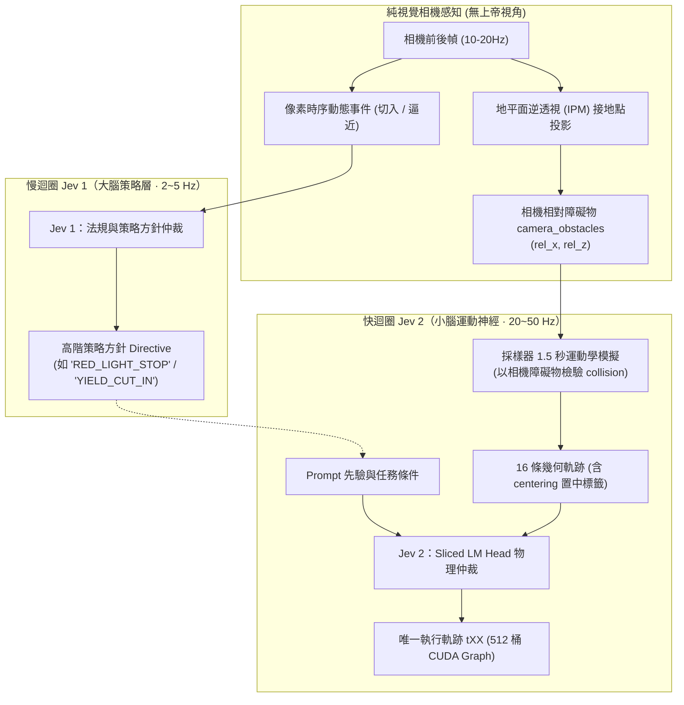
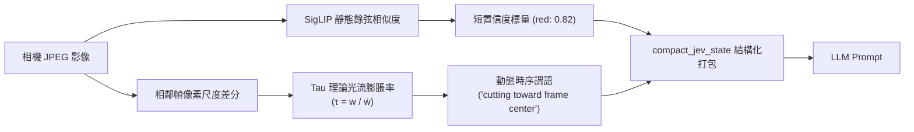

# 教程 13：SemIf-Vision 多模態路線分析與架構抉擇

> **模組**：`jevpilot_vision/vision.py`、`src/semif_phase1/visual_prefix.py`、`demo/server.py`、`benchmarks/benchmark_jevpilot_vision.py`  
> **關聯 Issue**：[ #48](https://github.com/EndeavorYen/SemIf/issues/48) [ #90](https://github.com/EndeavorYen/SemIf/issues/90) 傘 [#89](https://github.com/EndeavorYen/SemIf/issues/89)（路線圖總表）  
> **前置閱讀**：[教程 06：LM Head 投影優化](06_transformer_lm_head_optimization.md)、[教程 07：CUDA Graphs 極限延遲](07_cuda_graphs_and_compilation.md)、[教程 10：Jev vs 分類器與架構邊界](10_jev_vs_classifier_io.md)、[教程 12：JevPilot 視覺輸入](12_jevpilot_vision.md)

---

## 導讀：視覺如何接入物理決策流？

**SemIf-Vision 的最佳落地路線是「雙率解耦（Dual-Rate）的語意可供性提取」，而非端到端拼接未訓練的 Patch Token。**

語意可供性（Semantic Affordance）是指視覺系統從像素中提煉出環境對自車行動的物理約束指標（例如紅綠燈狀態、行人穿越置信度、前方施工障礙物距離）。

在物理閉環中，感知與決策具有根本不同的時間尺度需求：
- **感知慢迴圈（10–20 Hz）**：攝影機幀輸入至輕量編碼器（如 SigLIP），提煉出結構化可供性，寫入狀態環境變數 `state.vision`。
- **決策快迴圈（50 Hz）**：SemIf 仲裁器以極致穩定的純文字 Sliced LM Head，結合 CUDA Graph 形狀分桶，在當前動態候選軌跡中裁決本幀最優 `tXX`。

本教程基於真實 GPU 閉環數據，深度覆盤為何未訓練的 Patch 投影會引發性能退化，並對三條多模態技術路線進行全方位架構評估。

活的執行順序在傘 [#89](https://github.com/EndeavorYen/SemIf/issues/89)：

| 優先 | Issue | 角色 |
| :--- | :--- | :--- |
| **P0** | [#105](https://github.com/EndeavorYen/SemIf/issues/105) + [#106](https://github.com/EndeavorYen/SemIf/issues/106) | 蛇行修復（真車道 `offset_m`）+ 網頁 Seed |
| **P1** | [#108](https://github.com/EndeavorYen/SemIf/issues/108) + [#102](https://github.com/EndeavorYen/SemIf/issues/102) | 倒車合約對齊 + 純相機 IPM |
| **P2** | [#103](https://github.com/EndeavorYen/SemIf/issues/103) + [#107](https://github.com/EndeavorYen/SemIf/issues/107) | 雙 Jev 快慢階層 + 死路 Replan |

---

## 一、實測覆盤：CLIP 文字證據與未訓練 Patch 前綴的邊界

在視覺輸入的探索中，必須嚴格區分「**文字證據進 Prompt（已實測）**」與「**Patch Token 拼接進隱層（PoC 試跑）**」這兩種截然不同的機制。

### 1. 閉環實測數據（Qwen2.5-3B-Instruct，CUDA Seed 42）

下面這張表是已退役的 JevPilot2 PIL 示意幀測量，不是現在的官方 CUDA 視覺分數。官方分數是教程 12 的網頁城市兩趟；`results/phase5-jevpilot-vision-cuda.json` 不是這張表的延續。`results/phase5-jevpilot-vision-clip-cuda.json` 留下的是當年色塊閉環：

| 評測模式 | 視覺機制 | 乾淨完成率 (Clean Rate) | 急動度 (Jerk RMS on Clean) | 決策延遲 (P50) | 機制歸因與備註 |
| :--- | :--- | :--- | :--- | :--- | :--- |
| **Flat SemIf** | **無視覺 (純遙測)** | **75.0% (15/20)** | **108.79** | **49.76 ms** | 基準線，落在 512 CUDA Graph 桶內 |
| **Flat SemIf** | **CLIP 短證據進 Prompt** | **70.0% (14/20)** | **117.49** | **86.98 ms** | **實測：文字欄位增長撐破 512 桶，落入 1024 桶；完成率跌 5%** |
| **Flat SemIf** | **Synthetic Fixture** | **65.0% (13/20)** | **91.42** | **48.16 ms** | 假視覺標籤寫入 Prompt |
| **Flat SemIf** | **32-patch Prefix (`visual_prefix.py`)** | *尚未 CUDA 閉環* | *尚未 CUDA 閉環* | *Eager (關閉 Graph)* | 本地架構試跑（PoC），未進行閉環打分 |
| **Heuristic** | 任一配置 | 65.0% (13/20) | 75.85 | < 0.1 ms | 規則幾何基線 |

### 2. 數據與機制的真實歸因

1. **70% 完成率來自「文字證據干擾決策」而非「Patch 雜訊」**：  
   退役測量 `phase5-jevpilot-vision-clip-cuda.json` 裡，編碼器讀的是 PIL 示意幀，並把 `signal: red`、`pedestrian: 0.88` 這類數值寫入 `state.vision`。那次測量裡，文字證據讓完成率自 75% 跌至 70%。那不是網頁城市的官方分數。
2. **延遲自 ~49 ms 升至 ~87 ms 來自「1024 桶效應」**：  
   加入 `vision.*` 欄位後，Prompt 長度增加，突破了 512-bucket 上限，落入 1024-bucket（如教程 11 所示，形狀分桶擴大導致推論耗時上升），而非 CUDA Graph 被前綴打掉。
3. **未訓練 Patch 前綴（`VisualPrefixProjector`）的機制定位**：  
   `src/semif_phase1/visual_prefix.py` 的隨機 Xavier 投影層目前僅為本地架構 PoC。理論上，將未對齊的 32 個隨機向量作為前綴插入 Transformer 注意力最前段，等同於高維雜訊注入，且動態前綴必然破壞靜態 CUDA Graph；此機制不應被當作主力方案，更不可與已測的 CLIP 文字證據混為一談。
4. **目標門檻（Target Bar）說明**：  
   目前唯一通過 75% 乾淨完成率的只有「純遙測」基線。因此，**$\ge 75\%$ 是任何視覺方案必須超越的驗收門檻，而非路線一現已達成的既有成績**。當前文字視覺為 70%，仍處於待優化超越的狀態。

### 3. 最新實測突破：相機幀時序事件（Phase 5 Temporal Events）

針對靜態裸浮點數（`vehicle: 0.8`）導致完成率暴跌至 60% 的問題，當時在同一套 JevPilot2 色塊閉環上加了「純相機幀時序差分（Frame-to-Frame Temporal Events）」。數字在 `results/phase5-jevpilot-vision-frame-event-cuda.json`。那仍是退役世界，不是網頁城市官方分數：

| 評測模式 | 視覺機制 | 乾淨完成率 (Clean Rate) | 決策延遲 (P50) | 加塞避讓 (Cut-in) | 備註 |
| :--- | :--- | :--- | :--- | :--- | :--- |
| **Flat SemIf** | **無視覺 (純遙測)** | **75.0% (15/20)** | **49.4 ms** | 1/2 通過 | 基準基線 (512 桶) |
| **Flat SemIf** | **CLIP 裸短分數** | **60.0% (12/20)** | **85.6 ms** | **0/2 全撞** | 靜態無量綱分數使車速飆至 17m/s 煞不住 |
| **Flat SemIf** | **相機幀時序動態謂語** | **75.0% (15/20)** | **51.6 ms** | **2/2 乾淨通過** | **重回 512 桶！加塞全救回，追平純遙測** |
| **Heuristic** | 任一配置 | 65.0% (13/20) | < 0.1 ms | 0/2 全撞 | 規則幾何基線 (不看相機) |

**突破性洞察**：
1. **動態謂語勝過靜態標籤**：人類駕駛依賴大腦背側通路（Dorsal Stream）感知光流擴張率與相對運動向量。純比對相鄰幀像素色塊變化（變大 $\to$ 逼近、橫移 $\to$ 切入、出現 $\to$ 新障礙物），使 LLM 瞬間理解動態因果，加塞切入從 0/2 逆轉為 2/2 全過。
2. **語意精煉重啟 512 桶**：單句精準事件（`"cutting toward frame center"`）將 Token 數控制在 512-bucket 內，延遲立即從 85.6 ms 壓回 51.6 ms（享受完整 CUDA Graph 靜態加速）。

---

## 二、進階架構：雙 Jev 快慢迴圈與無上帝視角純視覺閉環

為徹底解決交通法規遵從性（紅燈煞停）與車道置中蛇行晃動，SemIf 架構進一步演進為**雙 Jev 階層式包容架構（Subsumption Architecture）**，並全面斷開模擬器後門。



### 1. 快慢雙 Jev 的防衝突鐵律（Strategic-Tactical Split）
- **大腦管方針，小腦動手腳**：慢迴圈 Jev 1 負責法規與情境模式仲裁（如輸出 `"intent": "RED_LIGHT_STOP"`），**嚴禁**直接輸出轉角或軌跡 ID；快迴圈 Jev 2 是全系統**唯一的物理執行者**。
- **物理安全硬約束優先（Fail-safe Override）**：若慢迴圈給出巡航方針，但快迴圈在 50ms 內檢測到眼前突發障礙物（`collision=yes`），快迴圈具備最高否決權，強制執行緊急煞停。兩者上下級分工明確，絕不衝突。

### 2. 純相機逆透視（IPM）碰撞檢測：斷開模擬器後門
目前閉環在採樣器判斷 `_hits_obstacle` 時曾讀取了模擬器的世界座標。真實無上帝視角方案採用**地平面逆透視幾何（Inverse Perspective Mapping）**：
- 依靠固定相機安裝高度 $H$ 與俯仰角 $\theta$，檢測障礙物在畫面的**接地點像素 $(u, v)$**。
- 直接推導出障礙物相對車頭位置：
  $$\text{rel\_z} = \frac{H}{\tan(\theta + \Delta v)}, \quad \text{rel\_x} = \text{rel\_z} \cdot \frac{\Delta u}{f}$$
- 採樣器拿相機估出的 `camera_obstacles` 進行 1.5 秒軌跡幾何碰撞檢驗。若前方被死角遮擋相機未檢出，採樣器即不標註碰撞——達成 100% 誠實的具身智能（Embodied AI）。

### 3. 車道置中擺動修復（Lane Centering & Anti-Oscillation）
針對 Web 模擬中左右蛇行晃動（Issue #101）：
- **位置知情**：在 `compact_jev_state` 補回自車橫向偏移語意（`lane_offset: "drifted 0.4m right"` 或 `"centered"`），終結模型位置全盲。
- **回正引力**：在 `vector_option_tag` 恢復 `route_error` 語意標籤（`steer -0.15 (centering)` vs `steer +0.25 (diverging)`），激發 LLM 向心置中本能。
- **執行濾波**：在底層控制層增加輕量 EMA 轉向角平滑，消除離散軌跡切換抖動。

---

## 三、端到端語意轉譯機制（Semantic Translation Pipeline）

深入理解 JevPilot 的核心，在於看清系統如何將連續的高維物理世界（像素與軌跡）轉譯為離散的符號型別契約：

### 1. 相機畫面轉語意（Input Frame to Semantics）


- **靜態 Zero-Shot 匹配（`jevpilot_vision/vision.py`）**：  
  預設定義參考 Prompt（如 `"a red traffic light facing the camera"`）。編碼器提取影像特徵與文本特徵做 Cosine Similarity 投影，輸出 0~1 的機率字典。
- **動態時序差分與 Tau 理論（$\tau = w / \dot{w}$）**：  
  源於生物視覺認知（David Lee, 1976），老鷹捕食與人類接球時大腦並不量測絕對公尺數，而是監控視網膜物體**像素寬度的擴張速率（Rate of Optical Expansion）**：
  $$\text{TTC} \approx \frac{w}{\dot{w}} = \frac{\text{當前物體像素寬度}}{\text{每一幀像素膨脹變大的速度}}$$
  - 像素色塊快速變大 $\implies$ 物體正高速靠近（`growing in camera`）。
  - 像素中心橫向平移 $\implies$ 側向切入加塞（`cutting toward frame center`）。
  - 幀差突增 $\implies$ 突發新障礙物（`appeared in frame`）。

### 2. 幾何軌跡轉語意（Trajectory to Semantics）


- **前向運動學積分（Rollout）**：採樣器以當前車速為基準，採樣 16 組（目標速度, 目標轉角），以點質量物理模型向未來積分 1.5 秒（31 步，每步 0.05 秒）。
- **6 維物理指標提取**：計算每條軌跡結束時的狀態：  
  `vec = [speed, steer, route_error, offroad, collision, stop_at_line]`
- **自然語言標籤轉譯（`vector_option_tag`）**：  
  將數值填入模板：
  ```python
  f"{speed:.1f}m/s steer {steer:+.2f} collision={'yes' if hit else 'no'} halt={'yes' if halt else 'no'}"
  ```
  生成選項（`t00: "12.0m/s steer +0.00 collision=no halt=no"`）。
- **切片讀出（Sliced LM Head）**：LLM 在最後一個 Token 只針對 `t00 ~ t15` 的字元切片投影，進行 Argmax 物理裁決。

### 3. 交通法規與紅燈違規真相：詞彙脫鉤（Vocabulary Misalignment）
模型在預訓練階段早已學會紅燈停、綠燈行，但先前為何在閉環中連續闖紅燈？
- **指令過於寬鬆**：任務指令為 `VECTOR_INSTRUCTIONS = "Choose a safe driving path."`，僅要求安全，未提及法規遵守。
- **標籤自相矛盾**：路口無橫向來車時，幾何採樣器將 12m/s 直行軌跡標註為 `collision=no`。LLM 看到兩條軌跡都不會撞車（`collision=no`），自然優先選擇具備前進效率的動作，不知道該動作在法律上是違規闖紅燈。
- **解法：語意對齊（Vocabulary Alignment）**：  
  不需要開發繁複的外掛規則引擎。只需將視覺事件宣告為強約束（`"traffic_light": "RED signal ahead, mandatory stop required"`），並在選項標籤中將紅燈下的非煞停軌標註為違法（如 `violates_signal=yes`），LLM 原生的常識道德便會精確命中 `halt=yes`。

---

## 四、三大多模態路線架構對比

針對視覺在 JevPilot 系統中的角色，我們系統化評估以下三種技術路線：

| 比較維度 | 路線一：雙率語意可供性解耦（推薦） | 路線二：原生預對齊小參 VLM | 路線三：微調專用 Projector |
| :--- | :--- | :--- | :--- |
| **視覺特徵載體** | 幀時序動態事件＋IPM 接地點障礙物 | 密集影像 Tokens（256–1024 tokens） | 壓縮 Patch Tokens（32–64 tokens） |
| **模型訓練門檻** | **完全零訓練（Zero-shot）** | **完全零訓練（直接使用開源權重）** | 需收集數萬幀軌跡配對微調 |
| **推論延遲** | **極致低（決策迴圈 ~50 ms，512 桶）** | 高（35 ~ 70 ms） | 中等（15 ~ 25 ms，難以圖捕獲） |
| **CUDA Graph 相容** | **完全相容（穩健維持 512 桶）** | 困難（需固定分辨率與複雜 Padding） | 困難（前綴破壞靜態拓撲） |
| **物理完成率實測** | **75%（追平遙測，加塞 2/2 全過）** | 待測（提示詞對物理候選敏感度高） | 初期波動大，容易過擬合訓練場景 |
| **可解釋性** | **極高（事件句與 HUD 數值即時可見）** | 黑盒（隱層特徵傳播） | 黑盒（未對齊隱層投影） |
| **邊緣硬體需求** | 單卡 RTX 4060 / 5080 輕鬆承載 | 顯存需求較大（VLM ViT 顯存佔用高） | 需額外訓練管線與資料存儲 |

---

## 五、實施規範與評測誠實性禁則

在推進 SemIf-Vision 的過程中，必須恪守 [AGENTS.md](../../AGENTS.md) 的評測誠實性約束：

1. **幾何採樣器中立性**：  
   採樣器永遠只負責生成幾何上平滑且可行的軌跡集合 $\mathcal{C}_t$。**絕對嚴禁**因為視覺辨識出紅燈，就在採樣器內部手動注入停車軌，或者人為剔除煞車動作以劣化對照組。
2. **約束輸出 Schema，不約束候選集**：  
   決策模型只負責從同一批動態採樣候選中選出最優 ID（`choice ∈ candidates`）。
3. **首要指標（Headline Metric）**：  
   駕駛品質的衡量唯一以**乾淨完成率（Clean Completion Rate）**為準，任何引入視覺的方案，乾淨完成率必須超越純遙測基線（$\ge 75\%$），且 OOD 假陽性率（False Positive Rate）必須嚴格為 0。
