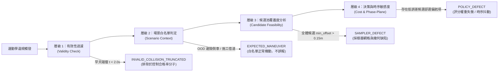

# 教程 14：模擬測試（Headless SIL）設計與考量——從二元勝負到微觀因果歸因

> **模組對應**：`src/semif_phase1/control_diagnostics.py`、`benchmarks/diagnose_control_quality.py`、`tests/test_control_diagnostics.py`  
> **關聯任務**：[ #117 無頭運動學品質診斷器](https://github.com/EndeavorYen/SemIf/issues/117)、[ #118 觀測器因果歸因與感知解耦](https://github.com/EndeavorYen/SemIf/issues/118)、[ #113 死區漫遊修復](https://github.com/EndeavorYen/SemIf/issues/113)、[ #110 起步倒車防禦](https://github.com/EndeavorYen/SemIf/issues/110)  
> **前置知識**：[教程 09：動態候選空間與語意仲裁](09_dynamic_candidates_and_arbitration.md)、[教程 10：Jev 與傳統分類器](10_jev_vs_classifier_io.md)

---

## 導讀：二元終局指標為何是模擬測試的毒藥？

**二元終局存活指標只能告訴你「自車死了沒有」，無法告訴你「自車是健康的還是苟延殘喘」。**

在自動駕駛與具身智慧的閉環評測中，傳統基準測試通常以「乾淨完成率（Clean Completion Rate）」為核心指標：只要自車在設定的時限內抵達終點，且未發生碰撞（Collision）、未闖紅燈（Red-light Violation）、未衝出道路邊界（Off-track），系統便給出一個滿分的 `PASS`。

然而，這種粗顆粒度的終局指標掩蓋了無數嚴重的運動學缺陷：
- 車輛可能在車道內以 $5\text{ Hz}$ 劇烈左右擺頭（Lateral Wander）；
- 車輛可能在起步瞬間突然倒車猛衝，隨後在 2 秒內急劇切換前進與倒車檔（Gear Chatter）；
- 車輛可能剛剛切入車道正中心，不到 0.2 秒就以高達 $0.6\text{ m/s}$ 的橫向漂移速度滑出中心死區（Central Deadband Escape）；
- 車輛可能在一條暢通無阻的道路上完全停滯，陷入長達數秒的規劃死鎖（Deadlock Stall）。

只要上述行為沒有直接撞上路緣或障礙物，二元基準測試就會盲目回報「100% 成功」。這導致工程團隊只能依賴人類在瀏覽器 Web 3D 介面中肉眼觀察「試車」，除錯成本呈指數上升。

本篇教程深入剖析專案中 **無頭軟體在環測試（Headless Software-in-the-Loop, Headless SIL）** 的設計哲學、常見陷阱、微觀運動學異常指紋，以及如何建立具備「因果歸因」能力的測試診斷管線，徹底消除盲測與猜問題。

---

## 一、模擬測試的三大設計陷阱

在建構千倍速無頭 SIL 觀測器（Observer）的過程中，最容易掉入以下三個方法論陷阱：

```mermaid
flowchart TD
    subgraph Trap1["陷阱一：感知與控制混淆 (Confounding)"]
        T1A["--fast 為了加速關閉相機 IPM"] --> T1B["障礙物清空 (obstacles = [])"]
        T1B --> T1C["候選軌跡全標為安全無碰撞"]
        T1C --> T1D["自車全速衝撞 (60% 碰撞率)"]
        T1D --> T1E["誤將感知缺失當作控制器缺陷！"]
    end

    subgraph Trap2["陷阱二：早夭截斷與倖存者偏差 (Survivorship Bias)"]
        T2A["自車在 t=1.2s 猛烈撞毀截斷"] --> T2B["時序長度未滿滑動視窗 (如 1.0s)"]
        T2B --> T2C["Observer 判定四大指紋皆未超標"]
        T2C --> T2D["報告盲目標註為 ok: true！"]
    end

    subgraph Trap3["陷阱三：症狀監控而非因果歸因 (Symptom vs Cause)"]
        T3A["抓出 31 起 Deadband Escape"] --> T3B["回報 t=4.7s 漂移速度超標"]
        T3B --> T3C["無法判斷是採樣器無解、評分權重失衡還是動力學超調"]
        T3C --> T3D["工程師只能盲調參數猜問題！"]
    end
```

### 1. 陷阱一：感知致盲污染控制評估（Perception Confounding）
在追求極速的 CPU 幾何邏輯掃蕩（Tier 1 `--fast`）時，若為了避開昂貴的相機渲染與視覺編碼，直接將感知模組「置空」（`obstacles = []`），會導致依賴感知標籤的軌跡採樣器（Trajectory Sampler）徹底失明。此時自車撞上行人或前車，本質上是**「無感知盲駛」**，而非控制器演算法失靈。若未將兩者解耦，測試數據便完全失去診斷價值。

### 2. 陷阱二：早夭截斷與倖存者偏差（Survivorship Bias）
運動學品質指標通常依賴滑動時序視窗（Sliding Time Window）計算統計量（例如計算 $1.0\text{s} \sim 2.5\text{s}$ 內的過零頻率或標準差）。如果一輛車起步 1 秒就劇烈撞擊而終止，短暫的軌跡根本不足以填滿計算視窗，Observer 會錯誤地認為「沒有任何超標違規」，得出 `ok: true` 的荒謬結論。

### 3. 陷阱三：只報症狀、不報原因（Symptom vs. Root Cause）
回報「自車在 $t=4.7\text{s}$ 橫向漂移速度達 $0.65\text{ m/s}$」只是一張**病歷表（Symptom）**，不是**病因診斷（Etiology）**。造成死區逃逸的病因可能是：
1. **採樣池缺陷（Sampler Defect）**：採樣器在該速度與曲率下根本沒有生成車道中央的平滑軌跡；
2. **決策權重失衡（Policy / Scoring Defect）**：採樣池有完美軌跡，但評分函數對速度的貪婪偏好壓過了對中心偏移的懲罰；
3. **場景必然機動（Expected Scenario Maneuver）**：當前遭遇感測器腐蝕（OOD）或施工繞行，緊急煞停倒車或借道是正確的避險行為。

若診斷器無法區分上述層級，測試便無法指導後續工程修復。

---

## 二、四大微觀運動學異常指紋（Kinematic Fingerprints）

在無頭閉環環境中，每個物理步階（$\Delta t = 0.05\text{s}$，即 20 Hz）收集狀態向量：
$$\mathbf{s}_t = [t, x, z, v, \delta, \text{lane\_offset}, \text{chosen\_id}, \text{chosen\_tags}]$$
診斷模組針對以下四項具備物理明確性的特徵進行數值閘門監控：

| 指紋代號 | 中文名稱 | 判定條件（Gates） | 物理本質與破壞性 |
| :--- | :--- | :--- | :--- |
| **`wander`** | 橫向蛇行漫遊 | $\sigma(\text{offset}) > 0.15\text{ m} \land f_{\text{zero\_cross}}(\delta) > 0.4\text{ Hz}$（滑動視窗 $\ge 1.0\text{s}$） | 方向盤過零率高且橫向偏移散佈大，代表控制器處於**欠阻尼震盪**，自車在車道內頻繁左右擺晃。 |
| **`chatter`** | 換檔前後抽搐 | 啟動前 $3.0\text{s}$ 內 $v < 0$；或 $2.0\text{s}$ 內符號翻轉 $\text{sign}(v) \ge 2$ 次 | 自車起步倒車（如早期採樣池倒車 index 污染）或在正負速度間高速震盪，損害傳動機構與舒適度。 |
| **`deadband`** | 中央死區逃逸 | 自車進入中心（$|\text{offset}| < 0.1\text{m}$ 持續 $\ge 3$ 步）後，於 $<0.5\text{s}$ 內以 $|\dot{x}| > 0.2\text{ m/s}$ 漂出 | 車輛缺乏中央「回正吸引力」或橫向速度阻尼不足，無法穩定維持車道中央，短暫碰觸中心線隨即脫離。 |
| **`deadlock`** | 規劃死鎖停滯 | $|v| < 0.2\text{ m/s} \land \Delta z < 0.5\text{ m}$ 持續時間 $> 3.5\text{s}$（排除紅燈等待） | 自車在無號誌障礙的情況下猶豫不決，無法產生成行動量，導致交通阻塞。 |

---

## 三、從「症狀觀測」躍遷至「四層因果歸因」

為了讓自動診斷具備實際修復指導能力，我們在架構上建立四層歸因分類管線：

### 1. 層級 1：有效性過濾（Validity Check）
若一個場景以碰撞結束且存活時長小於 $2.0\text{s}$，自動標記為 `INVALID_COLLISION_TRUNCATED`。此標記直接阻斷 Observer 的「假陽性合格（False-Positive Clean）」，確保控制品質評估只針對「具備完整控制觀測窗口」的樣本。

### 2. 層級 2：場景白名單判定（Scenario Whitelist）
在 `sensor_anomaly`（感測器腐蝕觸發 OOD 避險）中，系統選擇煞停或低速倒車是符合預期的避險行為；在 `construction_detour` 中，車輛必須偏離車道中心繞行路障。歸因器會先對照當前場景的預期語意指令，避免將正當機動誤判為 `chatter` 或 `wander`。

### 3. 層級 3：採樣池覆蓋度分析（Candidate Feasibility）
當發生 `deadband` 或 `wander` 時，Observer 提取違規發生幀的所有有效（安全無碰撞）候選軌跡向量，計算其最低橫向偏航量：
$$x^*_{\min} = \min_{i \in \text{SafeCandidates}} |x_i|$$
- **若 $x^*_{\min} > 0.15\text{ m}$**：說明採樣器在該特定曲率與車速下，根本沒有提供車道中央的候選選項。責任歸屬在 **採樣器（Trajectory Sampler）**。
- **若 $x^*_{\min} \le 0.05\text{ m}$**：說明採樣池內有極佳的中心維持軌跡，但決策器卻選擇了高偏航軌跡。責任歸屬在 **策略評分層（Policy / Scoring）**。

### 4. 層級 4：相平面特徵與時序跳變（Phase-Plane & Action Jitter）
在橫向偏移 $x$ 與橫向速度 $\dot{x}$ 的相平面（Phase-Plane）上，控制系統的行為特徵清晰可見：
1. **欠阻尼超調（Underdamped）**：軌跡在相平面上呈現螺旋擴散或大型橢圓軌道，伴隨方向盤頻繁反打，需調降比例增益（Proportional Gain）；
2. **阻尼不足（Under-damped Drift）**：車輛越過 $x=0$ 時橫向速度 $|\dot{x}|$ 極大，代表控制器缺乏微分阻尼項（Derivative Damping）；
3. **時序跳變（Action Switching Jitter）**：相鄰兩幀（每 0.1s）在相異動作 ID 間劇烈跳變（例如從偏左的 `v1` 瞬間跳到偏右的 `v5`），代表評分函數在邊界處過於陡峭，需要加入動作慣性約束（Action Persistence）。

---

## 四、模擬測試工程準則（SIL Engineering Discipline）

在 SemIf 專案中，所有的模擬測試與品質觀測必須遵守以下工程鐵律：

1. **輕量測試不能犧牲幾何真值**  
   `--fast` 模式旨在免除 GPU 記憶體搬移與 Transformer 推論耗時，以 CPU 純幾何邏輯達到 100x 速度。但**環境邊界與障礙物幾何真值（Ground-Truth Bounding Boxes）必須保留**。拔除感知等於讓車輛盲駕，測出的運動學數據毫無意義。
2. **評估誠實性高於一切**  
   任何關於神經模型（如 Flat SemIf）駕駛能力的結論，必須來自獨立且未經偽造的 CUDA GPU 運行；Mock 程式碼產生的測試只能作為邏輯回歸驗證，嚴禁用 Mock 成績冒充模型實力。
3. **工單自動化必須派發病因而非病徵**  
   自動開單（`--file-issues`）必須聚合相同場景與相同病因（如 `[POLICY_DEFECT]`），並附帶相平面數據與觸發幀 Candidates 快照。嚴禁針對單一病徵在不同 Seed 上重複洗版開單。

---

## 結語

測試的深度決定了架構演進的上限。透過將測試從「粗糙的終局二元存活」推進到「20 Hz 高頻微觀運動學指紋」，並進一步建立「採樣池覆蓋度 vs. 策略評分」的因果歸因矩陣，團隊才能在無須人工肉眼試車的前提下，以高置信度快速迭代運動控制與語意決策系統。
